# Cloud Practitioner (<span data-nospell>CLF</span>-C01) & Developer Associate (<span data-nospell>DVA</span>-C02) Certifications

Notes taken during studies for these AWS certifications, and has been organised into sections that map to the Udemy course I was following.
Much of this information was common knowledge to me, but has been written down for the purposes of keeping notes on topics that may be questions within the exams.

## Section 3: What is cloud computing?

### Deployment models

- **Private cloud** contains cloud services used by a single organisation, and not exposed to the public.
- **Public cloud** refers to cloud resources owned and operated by a third party service provider—and delivered over the internet (GCP, Azure, AWS).
- **Hybrid cloud** mixes both of the above, and supports some on-premise services, with extension and more capabilities via the public cloud.
    This is good for data governance and sensitive documents.

### Cloud computing types

- **IaaS** (Infrastructure as a Service), no need to manage networking, storage, servers, and virtualisation.
    An example of this is EC2.
- **PaaS** (Platform as a Service), additionally no need to manage runtime, middleware, or the operating system.
    An example of this is Elastic Beanstalk.
    - **FaaS** (Functions as a Service) which lets us run arbitrary code without worrying about the underlying infrastructure.
- **SaaS** (Software as a Service), additionally no need to manage applications or data.
    For example, Rekognition for Machine Learning.

### AWS Pricing fundamentals

1. Pay for the exact compute time.
2. Pay for the exact amount of data stored in the cloud.
3. Pay for data transfer out of the cloud.

### AWS Cloud History

| Year | Event                                                    |
|------|----------------------------------------------------------|
| 2002 | Internally launched                                      |
| 2003 | Amazon identified infrastructure as their core strength. |
| 2004 | Publicly launched with SQS.                              |
| 2006 | Relaunched with SQS, EC2, & S3.                          |
| 2007 | Launched in Europe.                                      |

### AWS Global Infrastructure

| Type               |                                                                                                                                                                                            |
|--------------------|--------------------------------------------------------------------------------------------------------------------------------------------------------------------------------------------|
| Regions            | AWS has regions all around the world. Names are usually region-number format—and is a cluster of data centres near to each other. Most services are “region-scoped”.                       |
| Availability Zones | Each region has many availability zones, usually three (min is 3, max is 6). These are named with a letter suffix after the region, for example <span data-nospell>ap-southeast-2a</span>. |

Each AZ is one or more discrete data centres with redundant power, networking, and connectivity.
This allows for separation, so that they’re isolated from issues.

| Infrastructure Type               |                                                                              |
|-----------------------------------|------------------------------------------------------------------------------|
| Data Zones                        |                                                                              |
| Edge Locations/Points of presence | Amazon has 400+ points of presence/edge location that provide a CDN service. |

### How do you choose an AWS region?

> *“If you need to launch a new application, where should you do it?”*

Factors that matter:

- **Compliance** with data governance and legal requirements.
    Data never leaves a region without permission.
- **Proximity** to customers reduces latency.
- **Availability of services**—not all services are available in every region.
- **Pricing** varies from region to region, consult the service pricing page.

### Shared Responsibility Model


Users are responsible for all security **in the cloud**, while AWS is responsible for security **of the cloud**.

## Section 4: IAM (Users & Groups)

IAM (Identity and Access Management) is a global service—and is used when you create an AWS Root Account on signup.
Key entities:

- **Users**, these are people within your organisation and can be grouped.
    Users do not have to belong to a group, or can belong to many groups.
- **Groups** can group users together.
    These cannot contain other groups.
- **Roles** let services (like EC2) perform actions on our behalf.

### Policies

Users, groups, and roles can be assigned a **policy**, which is a JSON document that describe the permissions of the users and groups.
A policy consists of:

- A **Version**, which defines the schema and structure of the policy (always `2012-10-17`, which was the last time the policy schema was updated).
- An **Id**, which is an optional name for the policy that you can provide.
- One or more **Statement**s, defining what permissions are granted or not granted.
    Within a statement, the following properties can be found:
    - A **Sid**, which is an optional name or identifier for the statement that you can provide.
    - An **Effect**, indicating if the statement is to allow or deny access (The strings either `Allow` or `Deny`).
    - The **Principal** which defines the user/account/role that the statement applies to.
    - The **Action**, which is an array of actions this statement allows or denies.
    - The **Resource** is an array of resources for which the actions apply to.
    - Optionally, a **Condition** for when this policy is in effect.

An example policy looks like:

```json
{
  "Version": "2012-10-17",
  "Id": "S3AccountPermissions",
  "Statement": [
    {
      "Sid": "1",
      "Effect": "Allow",
      "Principal": {
        "AWS": ["arn:aws:iam::123456789:root"]
      },
      "Action": [
        "s3:GetObject",
        "s3:PutObject"
      ],
      "Resource": ["arn:aws:s3:::mybucket/*"]
    }
  ]
}
```

When configuring a policy, apply the **least privilege principle**—don’t give more permissions than a user needs.
Policies can be applied to groups, and will *inherit* to the users within that group.
An **inline policy** is a policy that is attached specifically to a user.

### Roles

Some AWS services will need to perform actions on your behalf—we can assign permissions to AWS services with IAM roles.
Some common roles:

- EC2 instance roles
- Lambda function roles
- CloudFormation roles

Roles can be created in the IAM service in the AWS console.
Each role can have multiple policies.
An example role looks like (TODO):

```json
{
  "": ""
}
```

### Security Tools

- **Credentials report**, which is a report that lists all of your account’s users, and the status of their various credentials.
    This is performed at the account level.

  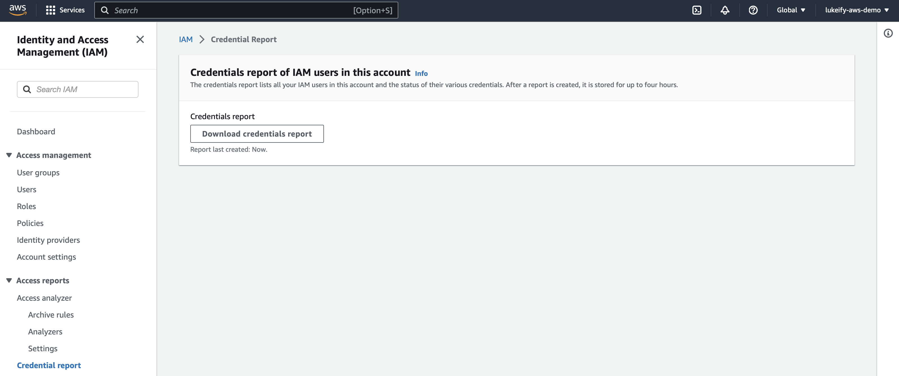

- **Access advisor** shows the service permissions granted to a user and when those services were last accessed.
    This is done at the user level.

  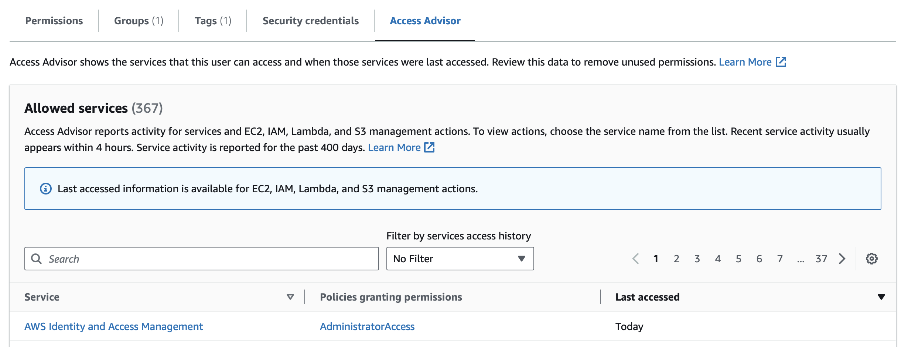

#### Password Policies

In AWS, you can configure password policies to ensure security for IAM users.
These policies can:

- Set minimum password lengths.
- Require specific character types (uppercase, lowercase, numeric, etc).
- Allow IAM users to change their own passwords after account creation.
- Require users to change their passwords after some time.
- Prevent password re-use when users change their passwords.

#### Guidelines & Best Practices

- Don’t use the root account except for AWS account setup.
- Create strong password policies, and enforce the use of MFA.
- Create and use Roles for giving permissions to AWS services.
- Use access keys for programmatic access.
- Audit permissions using the IAM Credentials Report & IAM Access Advisor.

#### MFA

Multi-factor authentication should always be required for the root account and IAM users.
For MFA, there are several device options:

- **Virtual MFA device** (such as Google Authenticator, Step Two, Bitwarden TOTP, etc)
- **Universal <span data-nospell>2nd</span> Factor (U2F) Security Key**, which is a physical security device that allows support for multiple root and IAM users.
- **Hardware Key For MFA device.**
- **Hardware Key For MFA device for AWS GovCloud (US).**
    This is provided by SurePassID for use within GovCloud applications.

### Accessing AWS

There are three options to access AWS:

1. **AWS Management Console**, protected by password and MFA.
2. **AWS Command Line Interface (CLI)**, protected by access keys.
3. **AWS Software Developer Kit (SDK)**, also protected by access keys.

Access keys can be generated through the AWS console.
Users manage their own access keys, and are secret.

### CloudShell

An alternative to issuing commands with the AWS CLI is to use CloudShell within the AWS Management Console.

### Shared Responsibility Model for IAM

AWS is responsible for:

- Infrastructure (global network security)
- Configuration and vulnerability analysis.
- Compliance validation.

We are responsible for:

- Users, groups, roles, policies, management, and monitoring.
- Enabling MFA on all accounts.
- Rotating all keys often.
- Using IAM tools to apply appropriate permissions.
- Analysing access patterns & reviewing permissions.

## Section 5: EC2

EC2 (Elastic Compute Cloud) provides Infrastructure as a Service, and consists of many capabilities:

- Renting virtual machines, called instances (EC2)
- Storing data on virtual drives (EBS)
- Distributing load across machines (ELB)
- Scaling the services using an auto-scaling group (ASG)

### EC2 User Data

When an EC2 instance starts, we can bootstrap our machines using an [EC2 User Data][1] script that is one once on instance first start; and can be used to automate tasks such as updates, software, download repositories, packages, or utilities—this runs as root user.

### EC2 Instance Types

There are six classes of EC2 instance types, [these can be found here][2].

- **General Purpose**, which are great for a diversity of workloads such as web servers, and offer a balance between compute, memory, and networking.
    The class prefix is `t` or `m`.
- **Compute Optimised**, optimised for compute-intensive tasks, such as batch process workloads, media transcoding, scientific modelling, dedicated gaming servers, etc.
    The class prefix for this group is `c`.
- **Memory Optimised** instances support processing large data sets in memory, such as databases, web cache stores, data modelling, etc.
    This group is prefixed as `r` (as well as `x` and `z`).
- **Accelerated Computing** provides access to accelerators and coprocessors to perform specific operations in hardware using CUDA, etc.
- **Storage Optimised** instances support storage-intensive tasks that require high read and write access, this could be file storage systems, web caches, etc.
    This group is prefixed with `i`, `d`, or `h`.
- **HPC Optimised** support the highest end performance computing tasks, such as deep learning, weather forecasting, and other scientific applications.
    The group prefix is `hpc`.

The instance type naming convention is as follows, for `m5.2xlarge`  for example, `m` is the instance class, `5` is the generation of hardware that the instance class runs, and `2xlarge` represents the size within the instance class.

[Amazon EC2 Instance Comparison](https://instances.vantage.sh/)

A useful comparison between EC2 instances

### Security Groups

[Control traffic to your AWS resources using security groups - Amazon Virtual Private Cloud][3]

**Security Groups** are the fundamental entity of network security on AWS, and controls how traffic is allowed into or out of our EC2 instances.
Containing a series of **allow rules**, each rule can reference and IP, or another security group.
They act like a firewall around our instances, and regulate:

- Access to ports
- Authorised IP ranges (both IPv4 and IPv6)
- Control of the inbound network (to the instance)
- Control of the outbound network (from the instance)

Other things to know:

- Security Groups can be attached to multiple instances, and each instance can have multiple security groups.
- Security groups are specific to a Region or VPC.
- It’s good to maintain one separate security group for SSH access.
- All inbound traffic is blocked by default, and all outbound traffic is allowed by default.
- Security groups can allow for a layer of indirection, by allowing a security group to refer to another security group (which may be attached to another instance), the former security group does not need any knowledge of the EC2 instance that is directing traffic to it.

Important ports to know:

| Port | Usage                                                               |
|------|---------------------------------------------------------------------|
| 21   | FTP                                                                 |
| 22   | SSH, SFTP                                                           |
| 80   | HTTP, for access to websites.                                       |
| 443  | HTTPS, for access to secure websites over TLS.                      |
| 3389 | RDP (Remote Desktop Protocol), used to log into a Windows instance. |

### SSH

The default user in the [Amazon Linux 2 AMI][4] is `ec2-user`.

### EC2 Instance Connect

An alternative to SSHing into an EC2 instance via the terminal is to use a variant of [EC2 Instance Connect][5] called within the AWS Management Console (note that there is an EC2 Instance Connect API via the AWS CLI that supports terminal access that is not covered here).

Note that if SSH access is disallowed via a Security Group, then EC2 Instance Connect will not work, as it uses SSH internally to upload a temporary SSH key.

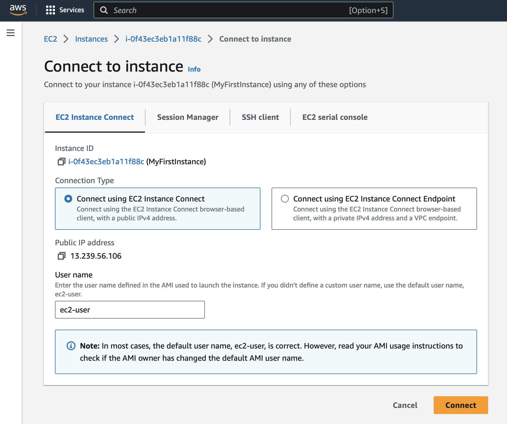

### EC2 Instance IAM Roles

IAM Roles can be attached to EC2 instances in the “Actions” dropdown of the EC2 console, under > “Security” > “Modify IAM Role”.
This is the preferred way to grant permissions to an EC2 instance—never attach a personal set of AWS credentials to an EC2 instance.

### Purchasing Options

- **On-demand instances**, short workloads, with predictable pricing, and you pay by the second; after the first minute for both Windows & Linux, [and after 24 hours for Mac][6].
    These have the highest ongoing cost, but has no upfront payment and no long-term commitment.
- **Reserved (1 or 3 years)**, useful for long workloads or where there is knowledge that the instance will be needed for a long duration, with up to a 72% discount compared to On-demand.
    You reserve specific instance attributes (instance type, region, tenancy, OS); and can pay with no upfront cost, partially upfront, or fully upfront.
    The reserved instance can be scoped to a region, or a zone; and can be bought or sold in the Reserved Instance Marketplace.
- **Convertible Reserved Instances** can be additionally used to change the instance type parameters (instance type, instance family, OS, scope, and tenancy) over time—this provides less discount (66%).
- **Saving plans (1 or 3 years)**, commit to a specific amount of usage, for long workloads; which also offer a 72% discount, but requires a commitment to a certain amount of usage (for example $10/hour for 1 to 3 years).
    Any usage beyond this is billed at the on-demand price.
    Savings plans lock you to a specific instance class & AWS region (for example `m5` in `us-east-1`), bit is flexible across instance size, OS, and tenancy.
- **Spot Instances**, use short workloads very cheaply (up to 90% discount), but instances can be taken back over by AWS on short notice, making them unreliable; as if your bid price is less than the current spot price, you will lose that instance.
    This makes them good for short jobs that are resilient to failure, workloads with a flexible start or end time; but are not suitable for critical jobs or databases.
- **Dedicated Hosts** allows you to book an entire physical server and control instance placement, addressing regulatory and compliance requirements, or use your existing server-bound software licences (per-socket, per-core, per-VM software licences).
    Dedicated hosts can be purchased on-demand, or reserved (for 1 or 3 years); this makes them the most expensive option on AWS.
- **Dedicated Instances** means that no other customers will share your hardware, but you have no control over instance placement (although hardware can be moved after Stop/Start).
    Here is a comparison between dedicated instances and dedicated hosts:

    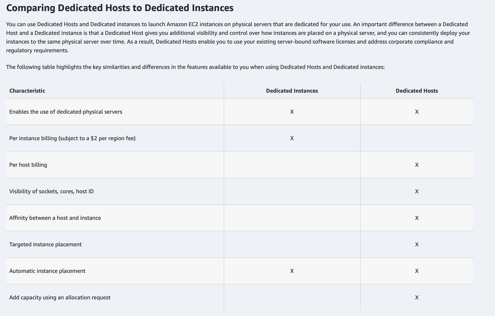

- [**Capacity Reservations**][7] allow you to reserve capacity in a specific AZ for any duration, enabling access to EC2 capacity when you need it. There is no time commitment, so you can cancel or create a reservation at any time. There is also no billing discounts, and you’re charged at On-Demand rate whether you run instances or not.
    These are useful for specific short-term workloads that must run in a particular AZ.

The exam will ask you to know to which purchasing option is right for a particular workload.

### Shared Responsibility Model for EC2

AWS is responsible for:

- Infrastructure (global network security).
- Isolation on physical hosts.
- Replacing faulty hardware.
- Compliance validation.

We are responsible for:

- Security Group rules.
- Operating system patches and updates.
- Software and utilities installed on the EC2 instance.
- IAM Roles assigned to EC2 & IAM user access management.
- Data security on your instance.

## Section 6: EC2 Instance Storage

### EBS Volumes

[An EBS (Elastic Block Store) volume][8] is a network drive you can attach to your instances while they run, allowing you to persist data, even after the corresponding EC2 instances’ termination—for the purposes of the Cloud Practitioner exam, they can only be mounted to one instance at a time (there is however a “multi-attach” feature for some EBS types), or zero instances, as an EBS volume *does not need* to be attached to an EC2 instance necessarily.

Each volume can be detached and re-attached from one EC2 instance to another very quickly, but each volume is bound to a specific availability zone, for example a volume in `us-east-1a` cannot be attached to an instance in `us-east-1b`.
However, a user can perform a snapshot to move a volume across AZs.

Each volume has a provisioned capacity of size measured in gigabytes, and performance in IOPS—this relates to your billing.
On the free tier, you receive 30GB of EBS storage of either General Purpose (SSD) or magnetic (HDD) per month.

There is an important attribute named **Delete on Termination**, that controls the behaviour of the EBS volume when the corresponding EC2 instance is terminated.

- By default, the root EBS volume is deleted (attribute enabled)
- By default, any other attached EBS volume is not deleted (attribute disabled).

[Make an Amazon EBS volume available for use on Linux - Amazon Elastic Compute Cloud][9]

Once an EBS volume is created, this link provides a guide on how to attach a volume.

### Snapshots

Snapshots allow you to take a backup of a volume at a point in time.
You don’t need to detach a volume to make a snapshot, *but it is recommended*.
Snapshots can be copied across between AZ’s and regions, making them useful as a mechanism of effectively moving around volumes.

- **EBS Snapshot Archive** allows you to move a snapshot to a slower, but cheaper location of storage, giving up a 75% cheaper, but requires 24 to 72 hours to restore from the archive.
- **Recycle Bin for ECS Snapshots** provides a mechanism to retain deleted snapshots so you can recover them after accidental deletion, with a user-specified retention time (from 1 day to 1 year).

### Amazon Machine Images

AMIs represent a customisation of an EC2 image, and define what the EC2 instance runs.
AMIs are built for a specific region, and can be copied across regions.
They can come from three flavours:

- **Public AMI**s. We can select from a list of default AMIs (such as Amazon Linux 2, Ubuntu, Windows Server, etc).
- **Custom AMI**s are ones we create, allowing you to add your own software, configuration, and monitoring.
    This can allow for a faster boot/configuration time because the software needed is prepackaged within the image.
- Or select an **AWS Marketplace AMI**, made (and potentially sold) by someone else.

The process of creating an AMI is relatively simple, and can be accomplished by right clicking on an instance, selecting “Image and templates”, then “Create an Image”.

1. Start an EC2 instance and customise it.
2. Stop the instance for data integrity purposes.
3. Build an AMI from the stopped instance, creating an EBS snapshot.
4. Launch an instance from our generated AMI.

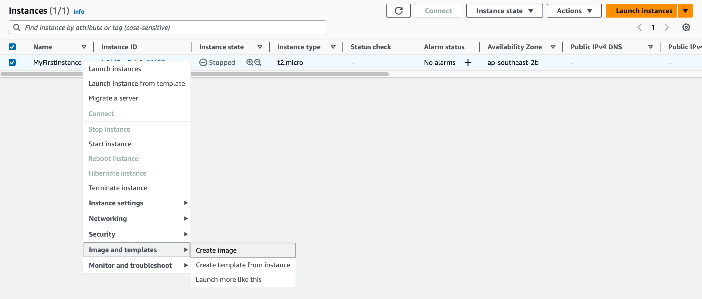

### EC2 Image Builder

**EC2 Image Builder** can be used to automate the creation of Virtual Machines or container images.
For the exam, this means it is a good tool to use for the creation, maintenance, validation, and testing of EC2 AMIs.
To do this, a user can define “image pipelines” that define the following flow:


This image pipeline can be defined to run on a schedule, for example, on a frequency basis, or whenever packages are updated, etc.
This is a free service, paying only for the base services, such as the builder & test EC2 instances, along with storing the AMI after its creation.

### EC2 Instance Store

EBS volumes are network drives with good but limited performance.
For higher performance, EC2 Instance Store can be used which utilises a physical connection on the server to a hardware disk.
This provides better I/O performance.
However, if you stop or terminate the associated EC2 instance, the data stored in the instance store will be lost, as the data is ephemeral.

This makes them good for buffers, caches, or temporary content—this makes backup and replication of your content your responsibility.

### Elastic File System (EFS)

**EFS** is a Managed NFS (Network File System) that can be mounted to multiple (or hundreds!) of EC2 instances.
This contrasts with EBS volumes that can only be attached to one EC2 instance at a time.
EFS only works Linux image types, and can work across Availability Zones.

It is, highly available, scalable, expensive (3× `gp2`), and paid per usage.
Use only 20GB? Pay for only 20GB.

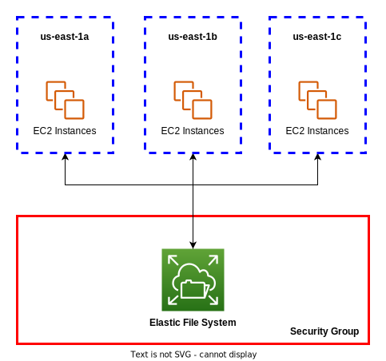

The default storage class is called “EFS Standard”.
An *additional storage class* for EFS is **Infrequent Access (EFS-IA)**.
This is a cost-optimised storage class for files that are accessed infrequently, with up to 92% lower cost.
IF EFS-IA is enabled, the EFS service will automatically move your files over to it based on the last time they were accessed, based on a lifecycle policy you define.
This implementation detail is transparent to applications accessing EFS.

// TODO: Insert diagram here

### Shared Responsibility Model for EC2 Storage

AWS is responsible for:

- Infrastructure.
- Replication of data for EBS volumes & EFS drives.
- Replacing faulty hardware.
- Ensuring their employees cannot access your data.

We are responsible for:

- Setting up backup & snapshot procedures.
- Setting up data encryption.
- Responsibility of any data on the drives.
- Understanding the risk of using EC2 Instance Store.

### FSx

FSx allows you to launch 3rd party high performance file systems on AWS as an alternative to EFS or S3.
This is a fully managed service with three options:

#### [FSx for Lustre][10]

**FSx for Lustre** (*Linux + Cluster*) provides a fully managed, high-performance, scalable file storage for **High Performance Computing (HPC)**.
This is useful for machine learning, video processing, etc.

Scales up to 100s of GB/s throughput, millions of IOPS, sub-millisecond latencies.

// TODO: insert diagram here

#### [FSx for Windows File Server][11]

This is a fully managed, highly reliable, and scalable **Windows native** shared file system; built on **Windows File Server**.
To implement this, you can deploy this flavour of FSx (usually across two AZ’s), giving you support for the Windows-native SMB protocol and Windows NTFS, allowing you to mount the filesystem on Windows machines.

This allows the file server in the AWS cloud to be accessed directly from Windows Server EC2 instances in AWS, or from the on-premises infrastructure of a corporate data centre with a Windows client (over SMB).

It is also integrated with Microsoft Active Directory for user security.

// TODO: insert diagram here

#### FSx for <span data-nospell>NetApp ONTAP</span>

Not covered as part of this course.

## Section 7: ELB & ASG

### Terminology

- **Scalability** means that your application/system can handle greater or lesser loads by adapting.
    There are two kinds of scalability:
    - An example of **vertical scalability** in AWS would be resizing an EC2 instance from `t2.micro` to `t2.large`.
        This is useful for non-distributed systems like databases, but there is usually a limit based on the hardware available.
    - An example of **horizontal scalability** in AWS would be increasing the number of instances for your application.
        This implies a problem that can be solved via a distributed system, which is common for web applications.

    > *The ability to accommodate a larger load by making the hardware stronger (scale up), or by adding nodes (scale out).*

- **High availability** is related to horizontal scalability, and means you are running your application in at least 2 availability zones, and is usually intended to survive a data centre loss.
- **Elasticity** can be defined as:

    > *Once a system is scalable, elasticity means there will be some auto-scaling so that the system can scale based on load. This is cloud-friendly, allowing you to pay-per-use, match demand, and optimise costs.*

- **Agility**.
    This is a distractor term and can be defined as:

    > *New IT resources are only a click away, which means that you reduce the time to make those resources available to your developers from weeks to just minutes.*

### Elastic Load Balancing

**Load balancers** are servers that forward internet traffic to multiple servers downstream. Behind each load balancer, there can be multiple EC2 instances, with the load balancer directing the traffic to an appropriate EC2 instance. Some advantages:

- Spread load across multiple downstream instances.
- Expose a single point of access (DNS) to your application.
- Seamlessly handle failures of downstream instances.
- Do regular health checks on your instances.
- Provide SSL Termination to your websites.
- High availability across zones.

AWS’s implementation of load balancing are called **Elastic Load Balancers**, and is a managed load balancer: AWS guarantees it will be working, takes responsibility for upgrades, maintenance, and high availability; while providing only a few configuration settings.
While it does cost less to setup your own load balancer with an EC2 instance, it will be a lot more effort.

There are four flavours of load balancers offered by AWS:

| Title                           | Layer        | Notes                                                                                                                                                                           |
|---------------------------------|--------------|---------------------------------------------------------------------------------------------------------------------------------------------------------------------------------|
| Application Load Balancer (ALB) | Layer 7      | HTTP, HTTPS, & gRPC traffic only. Provides HTTP routing. Useful for a static DNS.                                                                                               |
| Network Load Balancer (NLB)     | Layer 4      | Ultra-high performance (millions of requests/sec). Allows for both TCP & UDP. Provides a Static IP via Elastic IP.                                                              |
| Gateway Load Balancer (GWLB)    | Layer 3      | <span data-nospell>GENEVE</span> Protocol on IP Packets. Routes traffic to firewalls that you manage on EC2 instances. Useful for intrusion detection & deep packet inspection. |
| Classic Load Balancer           | Layers 4 & 7 | Retired in 2023, replaced by both ALB & NLB.                                                                                                                                    |

#### Application Load Balancer

// TODO: Create image

#### Network Load Balancer

// TODO: Create image

#### Gateway Load Balancer

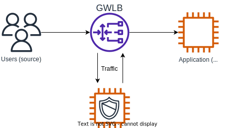

### Auto Scaling Groups

In real-life, the load on your websites and applications can change.
By utilising an **Auto-Scaling Group** (ASG), we can:

- Scale out (add EC2 instances) to match an increased load.
- Scale in (remove EC2 instances) to match a decreased load.
- Ensure we have a minimum and maximum number of machines running at any point in time.
- Automatically register new instances to a load balancer.
- Replace & deregister unhealthy instances.

This provides cost savings as we are always running at an optimal capacity. ASGs can have the following scaling strategies:

- **Manual scaling**, by updating the size of an ASG manually, in the AWS Management Console.
- **Dynamic scaling**, by responding to changing demand, with the following implementations:
    - **Simple/step scaling**, for example, when a “CPU > 70%” CloudWatch alarm is triggered then add 2 units, or when a “CPU < 30%” CloudWatch alarm is triggered, then remove one unit.
    - **Target Tracking scaling**, by defining the average CPU usage across the ASG to stay around a particular value (such as 40%).
    - **Scheduled scaling**, by anticipating increases and decreases in usage at particular times and dates (i.e. increase units at 5PM on a Friday).
- **Predictive scaling**, by using machine learning to predict future traffic ahead of time; by looking at past usage patterns.
    It will automatically provision the right number of EC2 instances in advance. Helpful when your load has predictable time-based patterns.

## Section 8: S3

Amazon S3 is one of the main products on AWS. It can be used for many purposes:

- Backup, storage, archiving, and disaster recovery
- Extensible to hybrid cloud storage (a mix of on-premises, while scaling into the cloud)
- Application & media hosting
- Data “lakes” & big data analytics
- Software delivery
- Static website hosting

### Terminology

**Objects** (files) are stored in **buckets** (top-level directories), which must have a globally unique name (across all regions in a “[partition][12]”, across all accounts); but each bucket is defined at a region level.
S3 looks like a global service, but buckets *are indeed* created in a region.
The following naming conventions for buckets exist (these are just some, for full details, [see the linked AWS documentation][13]):

- Can only consist of lowercase letters, numbers, periods, and hyphens.
- Must be between 3–63 characters long, and must begin and end with a letter or number.
- Cannot be an IP address.
- Cannot start with the prefix `xn--` or `sthree-` or `sthree-configurator`.
- Cannot end with the suffix `-s3alias` (this suffix is reserved for “access point alias names”).
- Cannot end with the suffix `--ol-s3` (this suffix is reserved for “Object Lambda Access Point alias names”).

**Objects** (files) have a key, which is the “full path” to the file, for example:

- `s3://my-bucket/my_file.txt`
- `s3://my-bucket/my_folder/another_folder/my_file.txt`

The key is composed of the `prefix` and the object’s “name”.
So for example, given the file above:

| prefix                      | object name   |
|-----------------------------|---------------|
| `my_folder/another_folder/` | `my_file.txt` |

There are no concept of directories with S3 (although the Management Console will convince you otherwise), and are just keys with components separated by slashes.

The maximum object size is **5TB**, and if the file is more than **5GB**, you must use the “multi-part upload” process to upload the file in parts.

Objects can contain additional information:

- **Metadata**, which is a list of text-based key-value pairs
- **Tags** which are also Unicode-based key-value pairs, and are useful for storing security & lifecycle policy information
- a **Version ID**, if versioning is enabled

### S3 Security

Security for S3 can be implemented in many ways. Overall, note that an IAM principal can access an S3 object *if*:

> *The user’s IAM permissions allow it, OR the resource policy allows it; AND there’s no explicit `deny` set.*

#### User-based security

**IAM Policies** can define which API calls should be allowed for a specific user from IAM.

#### Resource-based security

- **Bucket Policies** are bucket wide JSON-based policies that are similar to IAM policies that can be configured within the S3 console, allowing other accounts to access—this is the most common method.
    For example:

```json
{
    "Version": "2012-10-17",
    "Statement": [
        {
            "Sid": "PublicRead",
            "Effect": "Allow",
            "Principal": "*",
            "Action": [
                "s3:GetObject"
            ],
            "Resource": [
                "arn:aws:s3:::examplebucket/*"
            ]
        }
    ]
}
```

These can be used to:

- Grant public access to the bucket.
- Force objects to be encrypted at upload.
- Grant access to another account (cross-account).

#### Access Control Lists

**Object Access Control Lists (ACL)** provides finer-grain security at the object-level (can be disabled), alternatively **Bucket Access Control Lists (ACL)** can be used, but are less common (can be disabled).

#### Encryption

**Encryption** can be used to encrypt objects in S3 using encryption keys.

#### Blocking Public Access

An additional setting in the S3 bucket creation screen is the “Block Public Access settings”—these are “on” by default as an extra layer of security to prevent data leaks.
Even if there is an S3 bucket policy to make a bucket public, if these are enabled, these settings override that.

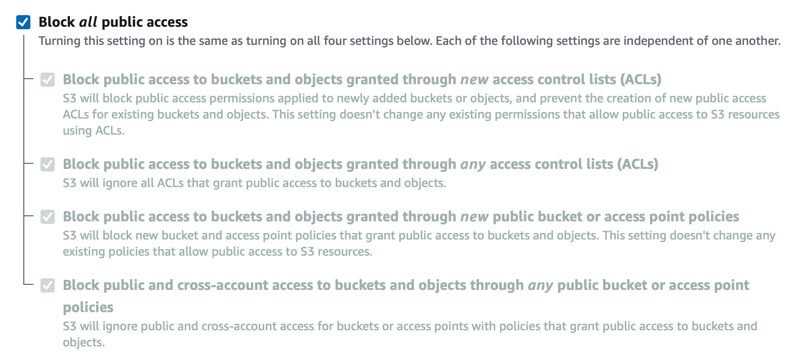

If you know none of the S3 buckets for an account should be public, these settings can be set at the account level.

### Static Website Hosting

S3 can host static websites and have them accessible on the Internet.
The website URL will be either (depending on region):

- `http://bucket-name.s3-website-aws-region.amazonaws.com`
- `http://bucket-name.s3-website.aws-region.amazon.com`

Note the difference between the `.` and `-` before `aws-region`.
If the bucket policy lacks public reads, the user will receive a `403 Forbidden`.

### Versioning

[Using versioning in S3 buckets - Amazon Simple Storage Service][14]

Amazon S3 objects can be versioned at the bucket level—so if a new object is added with the same key as an existing object, the object will be overridden and the version of the object incremented.
This prevents unintentional deletes by allowing previous versions to be rolled back at a later date.
Additional information:

- Any file that is not versioned prior to enabling versioning will have a version `null`.
- Suspending versioning does not delete previous versions of files.


### Replication

**Cross Region Replication (CRR)** & **Same Region Replication (SRR)** allow us to implement asynchronous replication between buckets—even between different AWS accounts.
Both the source and destination buckets must have versioning enabled for this functionality to work, and the S3 service must be given the proper IAM permissions.
The former replication strategy requires the buckets to be in different regions, while the latter requires them to be in the same region.

Use cases:

- **CRR** can be useful for compliance, lower latency access, replication across accounts.
- **SRR** can be used for log aggregation, or live replication between production and test accounts.

### Storage Classes

Objects can be stored in a “class” in S3, and can be moved automatically between storage classes using S3 Lifecycle Policies. There are a few groups of classes:

- **Standard**, consisting of:
    - **General Purpose**
        - 99.99% availability, used for frequently accessed data that need low latency and high throughput.
            It can sustain 2 concurrent facility failures and remain accessible.
    - **Infrequent Access (IA)**
        - This has a lower cost than S3 Standard, but has a per-access cost for retrieval; making it useful for data that is less frequently accessed, but still requires rapid access when needed.
        - It is also slightly less available, at 99.9%.
            It makes a good use case for disaster recovery and backups.
    - **One Zone-Infrequent Access**
        - This is similar to Standard IA, but is only available in a single AZ with no replication.
            For example, the data will be lost if the AZ is destroyed.
        - It is even less available, at 99.5%.
            Useful for storing secondary backups, and recreatable data.
- **Glacier**, which provides low-cost object storage meant for archival or backups.
    You pay both for the storage, and for retrieval costs.
    Consisting of:
    - **Instant Retrieval**
        - Millisecond retrieval, for example accessing data needed once per quarter, but has a minimum storage duration of 90 days.
    - **Flexible Retrieval** (formerly Amazon S3 Glacier)
        - Within this class, there’s three levels of flexibility, that provides differing amounts of time you must wait for your data to be retrieved:
            - Expedited (1–5 minutes)
            - Standard (3–5 hours)
            - Bulk (5–12 hours)
    - **Deep Archive**
        - This requires a minimum storage duration of 180 days.
        - Within this class, there’s two levels of flexibility:
            - Standard (12 hours)
            - Bulk (48 hours)
- **Amazon S3 Intelligent Tiering** is an additional approach that can move objects between tiers based on usage patterns to access those objects.
    There is a small monthly monitoring and auto-tiering fee.
    There are no retrieval charges in S3 Intelligent-Tiering. Within this class, there are 5 tiers:
    - **Frequent Access Tier**, which is the default tier items are placed into.
    - **Infrequent Access Tier**, for objects not accessed for 30 days.
    - **Archive Instant Access tier**, for objects not accessed for 90 days.
    - **Archive Access Tier**, is an opt-in tier for objects not accessed between 90 days and 700+ days.
    - **Deep Archive Access Tier**, is an opt-in tier for objects not accessed between 180 days and 700+ days.

Classes can be measured in both **durability** and **availability**. For durability:

- AWS guarantees eleven 9’s (99.999999999%) of durability over a single year.
    For example, if you store 10 million objects, you can expect on average to lose a single object once every 10,000 years.
    This is the same for all storage classes.

For availability:

- Measures how often the service is accessible.
    This varies depends on the storage class, for example S3 Standard has 99.99% availability over a given year, meaning an average we can expect the service to be unavailable for 53 minutes a year.

### Encryption

**Serverside Encryption** is default on AWS S3, this enables encryption at rest.
The user can also encrypt a file before uploading it (**Clientside Encryption**), which effectively enables encryption during transit.

### Shared Responsibility Model for S3

AWS is responsible for:

- The infrastructure of S3 (global security, durability, availability, the ability to sustain concurrent loss of data in two facilities, etc)
- Configuration and vulnerability analysis
- Compliance validation

We are responsible for:

- Versioning
- Bucket Policies
- Replication Setup
- Logging & Monitoring
- Using the most optimal Storage class
- Data encryption at rest and in transit

### Snow Family

These are highly secure, portable, physical services used to collect and process data at the edge, and migrate data into and out of AWS, recommended for migrations where it would take more than week to transfer over a network.

Data migration can be very slow for large transfers, along with having to deal with limited connectivity, limited bandwidth, and have a high network cost, and Snow Family devices solve this.
These services are:

- **Snowcone** is a very small portable computing device that is rugged and secure, weighing in at 2.1kg; and designed for small data transfers, edge computing and storage.
    - Useful for where Snowball does not fit (such as a space-constrained environment), but you must provide your own battery and cables.
    - Can be sent back to AWS offline, or connect it to internet via **AWS DataSync.**
    - It comes in two flavours:
        - **Snowcone**, providing 8TB of HDD storage.
        - **Snowcone SSD**, providing 14TB of SSD storage.
- **Snowball Edge** is useful for large data cloud migrations, data-centre decommissioning, and disaster recovery.
    When used for data transfers:
    - It is used to move TBs or PBs in or out of AWS, providing an alternative to moving data over the network.
    - There is a fee per data transfer job.
    - It provides block storage and AWS S3-compatible object storage.
    - It comes in two flavours:
        - **Snowball Edge Storage Optimised**, providing 80TB HDD capacity.
        - **Snowball Edge Compute Optimised**, providing 42TB HDD or 28TB NVMe capacity.
- **Snowmobile** is a gigantic fucking truck, allowing you to transfer exabytes of capacity, with each snowmobile providing 100PB of capacity (if more transfer storage is needed, these can be combined in parallel).
    - Each snowmobile is temperature controlled, has GPS tracking, and 24/7 video surveillance.
    - More useful than Snowball if the data transferred is more than 10PB.

|                  | Snowcone & Snowcone SSD        | Snowball Edge (Storage Optimised) | Snowmobile              |
|------------------|--------------------------------|-----------------------------------|-------------------------|
| Storage Capacity | 8TB HDD, 14TB SSD              | 80TB Usable                       | 100 PB                  |
| Migration Size   | Up to 24TB, online and offline | Up to petabytes, offline          | Up to exabytes, offline |
| DataSync agent?  | Preinstalled                   | N/A                               | N/A                     |

#### Usage Process

1. Request Snowball devices from the AWS Console for delivery
2. Install the snowball client / AWS OpsHub on your servers
3. Connect the snowball device to your servers and copy files using the client
4. Ship back the device to the AWS facility on data transfer completion
5. Data will appear in an S3 bucket
6. Snowball is wiped according to NIST specifications

#### Edge Computing with Snow Family devices

Snow family devices can also be used to process data in an *edge location*—even a location that does not have internet access.
The use cases include:

- Data preprocessing
- Machine learning at the edge
- Transcoding media streams

Eventually, the data can be shipped back to an AWS facility for cloud integration.
The snow family devices providing edge computing are:

- **Snowcone** & **Snowcone SSD** (smaller)
    - 2 CPUs, 4GB of memory, wired or wireless access
    - USB-C power using a cord or an optional battery
- **Snowball Edge** devices can be run EC2 instances and execute AWS Lambda functions (using [AWS IoT Greengrass][15]), are available for long term deployment with 1 and 3 year discounted pricing available, and come in two flavours:
    - **Compute Optimised**
        - Up to 104 vCPUs, 416GiB of RAM, with an optional GPU
        - 28TB NVMe or 42TB HDD
        - Clustering can be enabled with up to 16 additional nodes for more storage
    - **Storage Optimised**
        - Up to 40 vCPUs, 80 GiB of RAM
        - 80TB of HDD storage

#### OpsHub

Historically, to use Snow Family devices, a CLI tool was needed to interface with them, which was difficult, so AWS OpsHub can be installed on your on-premise computer/laptop that provides a [AWS Dashboard-like experience][16] to manage your Snow Family device, and can be used to:

- Unlock and configure single or clustered devices,
- Transfer files,
- Launch and manage EC2 instances,
- Monitor device metrics (such as storage capacity, active instances, etc),
- Launch compatible AWS services locally (EC2, DataSync, Network File System)

### Storage Gateway

AWS is pushing for “hybrid cloud” (where part of your infrastructure is both on-premises and in-cloud)—and S3 supports this, despite being a proprietary storage technology, via **AWS Storage Gateway**. A quick review of AWS cloud native storage options:

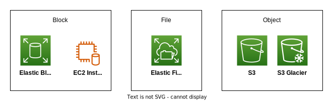

Storage Gateway bridges your on-premise and cloud data.

## Section 9: Databases

A summary of the different offerings of AWS’s database tools.

|                       | RDS                                | Aurora              | ElastiCache      | DynamoDB | RedShift              | DocumentDB | Neptune |
|-----------------------|------------------------------------|---------------------|------------------|----------|-----------------------|------------|---------|
| Type                  | Relational                         | Relational          | In-memory        | NoSQL    | Relational (Columnar) | NoSQL      | Graph   |
| OLAP vs. OLTP         | OLTP                               | OLTP                | N/A              | N/A      | OLAP                  | N/A        |         |
| Underlying Technology | MySQL, PostgreSQL, SQL Server, etc | MySQL or PostgreSQL | Redis, Memcached | N/A      | PostgreSQL            | MongoDB    |         |
| Serverless?           | No                                 |                     |                  | Yes      |                       |            |         |

### Shared Responsibility Model for Databases

AWS offers to manage different databases, which provides quick provisioning, high availability, as well as both vertical and horizontal scaling; along with automated backups, restores, operations, and upgrades.
OS patching for the database itself is handled by AWS, and monitoring and alerting is available.
You could also run databases on EC2 instances, but this non-managed approach requires you to handle all of the above tasks.

### RDS

**Relational Database Service** is a *managed database service* for database types that use SQL as a query language, for example Postgres, MySQL, MariaDB, Oracle, SQL Server, as well as Aurora (an AWS proprietary solution).
This gives us:

- Automated provisioning, OS patching
- Continuous backups and restore to a specific timestamp (via point-in-time restore).
- Monitoring dashboards
- Read replicas for improved performance
- Multi-AZ setup for disaster recovery
- Maintenance windows for upgrades
- Scaling capability (both horizontal and vertical)
- Storage is backed by EBS (`gp2` or `io1`)

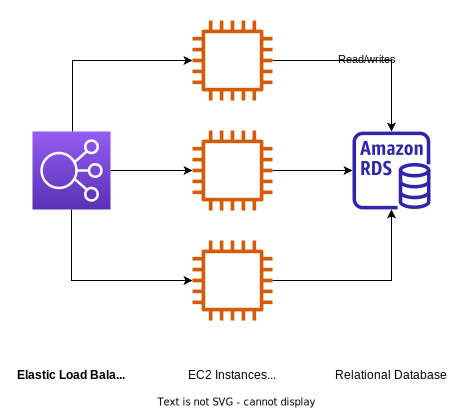

#### Deployments on RDS

Multiple architectural choices can be made to improve RDS deployments.
For example:

- **Read replicas**.
    You can create duplicate copies (up to 15) of the database that function as read-only databases, allowing a single primary database to handle the writes.
- **Multi-AZ** allows you to failover in case of an AZ outage, providing high availability.
    This can be configured by creating a failover database via replication.
    Once setup, RDS will failover if the main database becomes unhealthy—otherwise the failover database will not be used.
    Only one other AZ can be used.
- **Multi-region read replicas**.
    This is similar to standard read replicas, except that a read replica is created in another region.
    This is useful for disaster recovery (as it allows an entire region to go out and still function) and provides improved local performance, there is however a replication cost to transferring the data between regions.
    // TODO: insert multi-region deployment diagram

// TODO: Add in Flashcards about RDS deployments

### Aurora

This is a proprietary *Database as a Service* technology (not open sourced), that supports both **PostgreSQL** and **MySQL**, the benefit claimed is that Aurora is “AWS cloud optimised” and claims 5× performance improvement over MySQL on RDS, and 3× the performance improvement over PostgreSQL on RDS.
Aurora storage automatically grows in increments of 10GB up to 128TB.

Aurora also costs more than RDS (20% increase, but is more efficient), and is not in the free tier.

### ElastiCache

ElastiCache provides managed Redis or Memcached—which are in-memory databases for high performance and low latency.
These tools help reduce load away from databases for read intensive workloads.

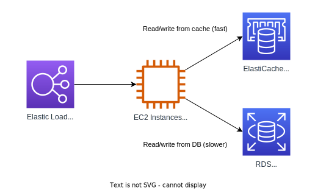

### DynamoDB

This is a fully-managed, highly-available proprietary NoSQL key-value *Database as a Service* with replication across 3 AZ's.
Features:

- Scales to millions/requests/s, trillions of rows, 100s of terabytes of storage
- Fast and consistent performance
- Single-digit millisecond latency
- Integrated with IAM
- Has both a Standard and Infrequent Access (IA) table class

// TODO: Structure of DynamoDB data

A primary key is composed of a partition key and a sort key.

#### Global Tables

You can make a DynamoDB table accessible with low latency in multiple regions using **global tables** via two-way replication.
Because read-or-writes can be performed in any regions, and the data will be replicated appropriately to create a consistent data store, this can be considered **active-active replication**.

//TODO: Global Tables diagram

#### DynamoDB Accelerator (DAX)

This is a fully managed in-memory cache explicitly for DynamoDB, and provides a 10× performance improvement for DynamoDB reads, providing three-digit microsecond latency when accessing DynamoDB tables.

It can only be used with DynamoDB.

### Redshift

**Redshift** is a PostgreSQL database solution that is used for **Online Analytical Processing (OLAP)** instead of Online Transaction Processing (OLTP), which can be used for analytics and data warehousing.
Instead of loading data continuously, data should be loaded infrequently at intervals.

Other differentiating factors include that it provides columnar-based storage (as opposed to row-based storage), and provides a [Massively Parallel Query Execution (MPP)][17] environment.

Pricing is pay as you go, based on provisioned instances; and has an SQL interface for performing queries, while allowing BI integrations such as AWS QuickSight or Tableau.

### DocumentDB

**DocumentDB** is a AWS implementation of the NoSQL database MongoDB, and is used to store, query, and index JSON data.
It is analogous to **Aurora**, and provides similar deployment concepts; while also being fully managed, and highly available with replication across multiple AZ’s.

DocumentDB storage automatically grows in increments of 10GB up to [128TiB][18].

### Neptune

Neptune is a fully-managed graph database that is highly available across 3 AZ's, with up to 15 read replicas; and is useful for building and running applications with highly connected datasets, such as knowledge graphs, fraud detection, recommendation engines, and social networking.

### QLDB

Quantum Ledge Database is a fully managed, serverless, highly available (3 AZ replication) ledger database useful for reviewing and capturing history made to application data over time.

- QLDB provides immutability that can be cryptographically verified.
    Behind the scenes, a *journal* captures sequences of modifications to your data, and then recomputes a cryptographic hash that can provide the data prior has not been modified or deleted.

This makes it useful for financial transactions and other applications requiring immutability.
It is 2–3× more performant than common ledger blockchain frameworks, and data can be manipulated via SQL.

Note that this is a **centralised solution**, unlike Managed Blockchain which provides a decentralisation component.

### Managed Blockchain

Blockchains make it possible to build applications where multiple parties can execute transactions without the need for a trusted, central authority.
Unlike QLDB, Amazon Managed Blockchain can be used to:

- Join public blockchain networks
- Create scalable private networks

It is compatible with the *Hyperledger Fabric*, *Ethereum*, & *Bitcoin* blockchain frameworks.

### Data Tools

#### EMR

[**Elastic MapReduce (EMR)**][19] is a tool for creating [Hadoop][20] clusters to analyse and process large amounts of data, by creating clusters of hundreds of EC2 instances to process this data.
EMR takes care of provisioning and configuring these instances for these tools.

Some use cases of this include data processing, machine learning, web indexing, and general big data utilities.

#### Athena

**Amazon Athena** is a serverless query service to perform analytics against S3 objects, using standard SQL language for queries.
It supports many file types including CSV, JSON, ORC, <span data-nospell>Avro</span>, and Parquet.

Athena is built on Presto, and is priced at a rate of $5/TB of data scanned.
Use cases include business intelligence, analytics, reporting, querying CloudTrail logs, and more.

#### QuickSight

You can create interactive dashboards using the serverless machine learning-powered BI service called **QuickSight**.
Uses cases include business analytics, building visualisations, performing ad hoc analysis, and extracting business insights.

#### Glue

**Glue** is a managed **extract, transform, and load (ETL)** service that can be used to prepare and transform your data for analytics.
Instead of using services for this, it is a fully serverless service that can be placed in your data pipeline before it is then loaded into another service or database.

%2085d2aae2a2d845babd8d884ace9fba86/GlueETL.svg)

There is also **Glue Data Catalog** (part of the Glue family), is a catalog of your datasets within your AWS infrastructure, which can be used by other AWS services such as Athena, Redshift, EMR, to build schemas for those datasets.

#### Database Migration Service

**DMS** allows us to extract data from a *Source DB* onto an EC2 instance running the DMS software, before loading it onto a *Target DB*; letting you quickly and securely migrate databases to AWS.
Additionally, the source database remains available during the migration.
It supports both:

- **Homogeneous migrations**, i.e. an Oracle database to an AWS Oracle database
- **Heterogeneous migrations**, i.e. Microsoft SQL Server to Aurora

## Section 10: Other Compute Services

### Elastic Container Service (ECS)

Elastic Container Service (ECS) lets us launch docker containers on AWS.
You must provision and maintain the underlying infrastructure (such as the EC2 instances that the containers will run on), but AWS will take care of starting & stopping those containers.

### Fargate

Fargate takes ECS on step further: you do no need to provision EC2 instances to run your docker containers on, AWS will run the containers using the RAM & CPU you need.
This makes it a *serverless* offering.

// TODO: Fargate diagram

### Elastic Container Registry (ECR)

Elastic Container Registry (ECR) is a private docker registry on AWS used to host and store Docker images that can then be run via ECS or Fargate.

### Lambda

Lambda is a serverless Functions-as-a-Service tool that runs specified compute tasks on demand in short executions, without having to manage servers, or deal with scaling.

Lambda is *event-driven*, and functions are invoked by AWS when needed.
Each function can be allocated [up to 10,240MB of RAM for that function’s execution][21], and RAM allocation is the primary mechanism through which Lambdas can be made more performant.

Lambdas support most popular languages natively (such as Node.js, Python, Java, C#, Go, and Ruby)—and any language that is not supported by AWS can use the [Custom Runtime][22] for execution.
Finally, docker containers can be executed via Lambda Container Images (provided these container images implement the [Lambda Runtime API][23]).

Lambda Pricing is per request/call, and per compute time/duration:

- Pay per request/call:
    - First 1,000,000 requests per month is free.
    - 20¢ per 1,000,000 requests thereafter.
- Pay per duration (in 1ms increments):
    - 400,000 GB-seconds of compute time is free (this is equivalent to 400,000 seconds if the function is invoked with 1GB of RAM, or 3.2 million seconds if the function is invoked with 128MB of RAM).
    - $1.00 per 600,000 GB-seconds thereafter.

To prevent broken or stalled Lambda functions from accumulating runtime costs, a timeout can be configured of anywhere between 1 second and 15 minutes to automatically cancel function execution.

### API Gateway

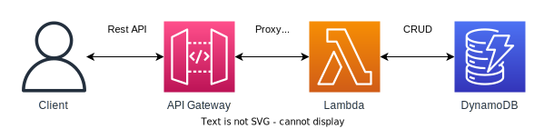

API Gateway provides tooling to configure a Rest API for clients to proxy requests to Lambda functions, letting third parties run these functions.
This provides developers with a fully managed serverless service to create, publish, maintain, monitor, and secure APIs.

It supports both REST & WebSocket APIs, along with security, user authentication, API throttling, and API keys.

### Batch

**Batch** is a fully-managed batch processing service for any scale.
In this context, a batch job is a unit of work with a defined start and end (as opposed to continuous work that might run on an EC2 instance, for example).

**Batch** will dynamically provision EC2 instances or Spot instances with the right amount of compute or memory to accommodate the load necessary—simply schedule your batch jobs with AWS.

Batch jobs are defined as Docker images and run on ECS, and is helpful for cost optimisations, letting you focus less on infrastructure.

#### Batch vs. Lambda

Lambda Limitations:

- There is a 15 minute time limit for all functions
- There are a limited number of programming runtimes to pick from
- There is limited temporary disk space

Batch Advantages:

- Has no time limit
- Any runtime is supported as it’s packaged as a Docker image
- Relies on EBS & instance store for disk space
- Relies on EC2 instances that are managed on AWS

### Lightsail

**Lightsail** provides virtual servers, storage, databases, and networking with low and predictable pricing.
It is a simpler alternative to using “complex” AWS services like EC2, RDS, ELB, EBS, Route 53, etc.

This is great for individuals with minimal cloud experience, hosting simple web applications, and websites.
It is highly available, but there is no auto-scaling, and it has limited AWS integrations.

## Section 11: Deployments & Managing Infrastructure at Scale

### CloudFormation

**CloudFormation** is a declarative way of outlining your AWS infrastructure, for any resources—like Terraform, providing _Infrastructure as Code_.

- No resources are manually created, which is excellent for version control.
- Changes to infrastructure can be reviewed through code.
- Each resource within a CloudFormation stack is tagged with an identifier, allowing you to see how much a stack costs.
- Ability to destroy and recreate infrastructure on the fly.
- The ability to automate the generation of diagrams for your templates using **CloudFormation Stack Designer**.

### Cloud Development Kit (CDK)

An alternative to CloudFormation's declarative approach is to define cloud infrastructure imperatively in your preferred programming language of choice, and have [CDK][24] compile it down to a CloudFormation template, making it possible to have your infrastructure and application runtime code not only packaged together, but written in the same language.

A CDK application that you write is converted into a CloudFormation template using the CDK CLI.

### Elastic Beanstalk

[**Elastic Beanstalk**][25] is a free, managed Platform-as-a-Service that provides developer-centric view into deploying an application on AWS—while still giving full control over the configuration of the underlying infrastructure.
Beanstalk handles:

- Instance configuration and the underlying OS.
- The deployment strategy (although it is developer-configuration).
- Capacity provisioning, load balancing, and auto-scaling.
- Application health monitoring and responsiveness.

This reduces the responsibility for the developer down to just the application code.
Beanstalk provides three architectural models:

- **Single instance deployment**, which is useful for development and testing.
- **ASG-only**, which is useful for non-user-facing applications such as workers and background processing.
- **LB & ASG**, which is best suited for production applications.

Beanstalk supports all common web application platforms (Go, Java, .NET with IIS, Node.js, PHP, Python, Ruby, both single & multi-container docker), but if there is a solution that is no supported, you can write your own custom platform.

Behind the scenes, ElasticBeanstalk manages all the services and tools using CloudFormation.

#### Health Monitoring

Beanstalk provides a health agent which pushes metrics to CloudWatch, and also checks for app health and publishes health events.

### Code-family

The code family of AWS developer tools provides an end-to-end software deployment service for our applications.
It is worth noting that many of these are deemed as “second-class” services by AWS users that mainly exist to offer a competing product to existing services.

| Step                           | AWS Tool     |
|--------------------------------|--------------|
| Source & version control       | CodeCommit   |
| Artifacts & package management | CodeArtifact |
| Build & CI/CD                  | CodeBuild    |
| Deployment & CI/CD             | CodeDeploy   |
| Pipeline & Orchestration       | CodePipeline |
| UI & Management                | CodeStar     |

#### CodeCommit

**CodeCommit** is a source & version control tool that is a competing product to GitHub, that hosts git-based repositories.
It is considered to be very bare bones by many, and is functionally used for allowing internal build tools and resources to access Git repositories through a VPC.

#### CodeArtifact

CodeArtifact is a package and software management repository ("artifact management system") that can be used by common package manager tools (such as `npm`, `yarn`, `nuget`, `maven`, etc) for the secure and private storage, publication, and retrieval of code dependencies and packages.

#### CodeBuild

**CodeBuild** is a serverless Continuous Integration (CI) tool that can build source code, run tests, and product packages ready to be deployed. Pricing is pay-as-you-go for only the resources you use, and includes 100 build minutes per month as a free tier.

#### CodeDeploy

**CodeDeploy** lets us deploy our application automatically independent of CloudFormation or ElasticBeanstalk, and works with EC2 instances as well as On-premise Servers.
It is therefore a hybrid service.

These servers or instances must be provisioned and configured ahead of time using the **CodeDeploy Agent**.

#### CodePipeline

**CodePipeline** lets us orchestrate the different steps to have the code automatically pushed to production, which is a serverless CI/CD tool and can be used to link the other code-family tools together.
For example:

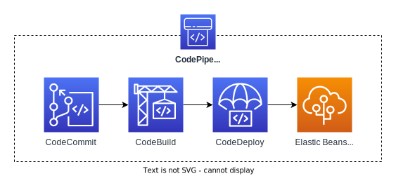

It is also compatible with many third-party services (GitHub, etc.).

#### CodeStar

**CodeStar** presents a unified UI to easily manage software development activities in one place, and is a quick way to get started with other Code-family tools.

### Cloud9

**Cloud9** is a cloud IDE for writing, running, and debugging code—accessible via your web browser; and also allows for code collaboration in real time (like most IDEs).

### Systems Manager (SSM)

This tool helps you manage your EC2 and On-premise systems at scale (this makes it another Hybrid AWS service), allowing you to receive operational insights about the state of your infrastructure.
Consisting of 13 products, the most important features are:

- Patching automation for enhanced compliance
- Run commands across an entire fleet of servers
- Store parameter configuration with the SSM Parameter Store

SSM requires the SSM agent to be present onto the systems we control, and it is installed by default on the Amazon Linux AMI and some Ubuntu AMIs.
It was previously called “Simple Systems Manager” which led to its abbreviation of SSM, which is still retained to this day.

#### SSM Session Manager

Session Manager is a feature of SSM that lets you start a secure show on your EC2 and on-premise servers without needing SSH access, bastion hosts, or SSH keys needed.
This lets you close port 22 (normally used for SSH).

The EC2 instance has an SSM Agent installed on it, and that agent is connected to the Session Manager service.
Users can connect to the Session Manager service via IAM permissions.

Session log data can also be sent to S3 or CloudWatch.

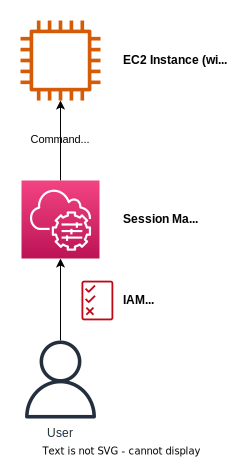

[1]: https://docs.aws.amazon.com/AWSEC2/latest/UserGuide/user-data.html
[2]: https://aws.amazon.com/ec2/instance-types/
[3]: https://docs.aws.amazon.com/vpc/latest/userguide/vpc-security-groups.html
[4]: https://aws.amazon.com/amazon-linux-2/?amazon-linux-whats-new.sort-by=item.additionalFields.postDateTime&amazon-linux-whats-new.sort-order=desc
[5]: https://docs.aws.amazon.com/AWSEC2/latest/UserGuide/ec2-instance-connect-methods.html
[6]: https://aws.amazon.com/ec2/instance-types/mac/
[7]: https://docs.aws.amazon.com/AWSEC2/latest/UserGuide/ec2-capacity-reservations.html
[8]: https://aws.amazon.com/ebs/
[9]: https://docs.aws.amazon.com/AWSEC2/latest/UserGuide/ebs-using-volumes.html
[10]: https://aws.amazon.com/fsx/lustre/
[11]: https://aws.amazon.com/fsx/windows/
[12]: https://docs.aws.amazon.com/whitepapers/latest/aws-fault-isolation-boundaries/partitions.html
[13]: https://docs.aws.amazon.com/AmazonS3/latest/userguide/bucketnamingrules.html
[14]: https://docs.aws.amazon.com/AmazonS3/latest/userguide/Versioning.html
[15]: https://aws.amazon.com/greengrass/
[16]: https://www.youtube.com/watch?v=0Q7s7JiBCf0
[17]: https://docs.aws.amazon.com/redshift/latest/dg/c_challenges_achieving_high_performance_queries.html#massively-parallel-processing
[18]: https://aws.amazon.com/documentdb/features/
[19]: https://aws.amazon.com/emr/
[20]: https://hadoop.apache.org/
[21]: https://docs.aws.amazon.com/lambda/latest/operatorguide/computing-power.html
[22]: https://docs.aws.amazon.com/lambda/latest/dg/runtimes-custom.html
[23]: https://docs.aws.amazon.com/lambda/latest/dg/runtimes-api.html
[24]: https://aws.amazon.com/cdk/
[25]: https://aws.amazon.com/elasticbeanstalk/
