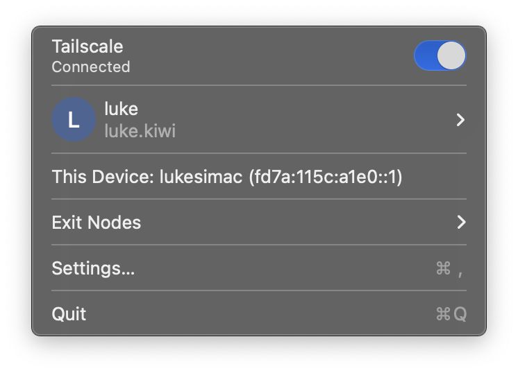

# [Headscale][1]

Provides an open-source re-implementation of the Tailscale control server, while preserving the ability to use Tailscale-provided applications and tools on clients.
This application is written in Go.

## Installation

Follow the [Linux installation steps][2].
Before doing so however:

1. Have the CNAME record for the subdomain that you intend to host Headscale on pre-configured.
2. Configure an email address for the ACME provider to deliver LetsEncrypt certificate renewal emails to.

Headscale can automatically retrieve a LetsEncrypt certificate for your `headscale` instance when providing a domain operating on port 443.
To enable this, ensure the `server_url` and `listen_addr` within the configuration are set to be `https`, and an address ending in `:443`, respectively.

Once configured, run `headscale` as a `systemd` service via `systemctl start headscale`.
Debugging headscale run failures can be done with `journalctl -u headscale.service -n 100 -f` (or alternatively by running headscale interactively via `headscale`).

### Reverse Proxy Configuration

By default, Headscale does not provide out of the box configuration to be located behind a reverse proxy, [and such resources are community maintained][2b].
With NGINX however, the process is reasonably simple:

1. Unset any TLS configuration settings from the Headscale `config.yaml` file:
   1. `acme_url` (left set for documentation purposes),
   2. `acme_email`,
   3. `tls_letsencrypt_hostname`,
   4. `tls_letsencrypt_cache_dir` (left set for documentation purposes),
   5. `tls_letsencrypt_challenge_type` (left set for documentation purposes),
   6. `tls_letsencrypt_listen`,
   7. `tls_cert_path`,
   8. `tls_key_path`

   Note that the `server_url` setting retains its `https://` suffix.
2. Introduce an `nginx` [configuration][2c] that enables SSL termination at the `nginx` level before passing on the traffic with the `proxy_*` directives.
   It's important to set the `Upgrade` and `Connection` headers appropriately in the proxy configuration—this is needed to pass WebSockets through.
3. Generate an SSL certificate for the server using `certbot`.
4. Restart `nginx` and `headscale`.

## Tailnet naming

Your client will initially report your Tailnet name as being `user@example.com` (where `user` is the username you provided).
This can be modified by configuring the `dns_config.base_domain` key in the `config.yaml` file in the Headscale coordination service to a domain of your choosing.

## macOS Tailscale client configuration

Install the standalone Tailscale client application for macOS directly from Tailscale, [as this has a number of advantages][3].
This is documented in the [comparison table][4].

* Allowing system extensions for macOS with Tailscale client

## Policy files

A tailnet policy file can be provided to Headscale to implement access control via ACLs.
This file is written in [HuJSON][5] (Human JSON), which is a Tailscale implementation of [JWCC][6] ("JSON with Commas and Comments").
Provide a tailnet policy file by specifying a filename to the `acl_policy_path` key within the Headscale configuration.

Note that `Headscale` will fail to start if provided a policy file with zero ACL's inside of it—even an empty `acls` array is not sufficient.

## CLI Notes

* Currently, it is only possible to expire API keys generated from the Headscale server, not delete them.
    Deleting keys involves [modifying the contents of the SQLite database][7] Headscale uses to store information within.
    However, this [feature has been landed][8] on the main branch for the next release.

## Usage with Fly.io

* How to run tailscale in an image for fly.io?

[1]: https://headscale.net
[2]: https://headscale.net/running-headscale-linux/
[2b]: https://headscale.net/reverse-proxy/
[2c]: https://headscale.net/reverse-proxy/#nginx
[3]: https://tailscale.com/kb/1065/macos-variants
[4]: https://tailscale.com/kb/1065/macos-variants#comparison-table
[5]: https://github.com/tailscale/hujson
[6]: https://nigeltao.github.io/blog/2021/json-with-commas-comments.html
[7]: https://github.com/juanfont/headscale/issues/1667#issuecomment-1951606032
[8]: https://github.com/juanfont/headscale/pull/1702

TODOS:

* How to make metrics internal only?
* How to enable GRPC for remotely controlling headscale server via the CLI?
