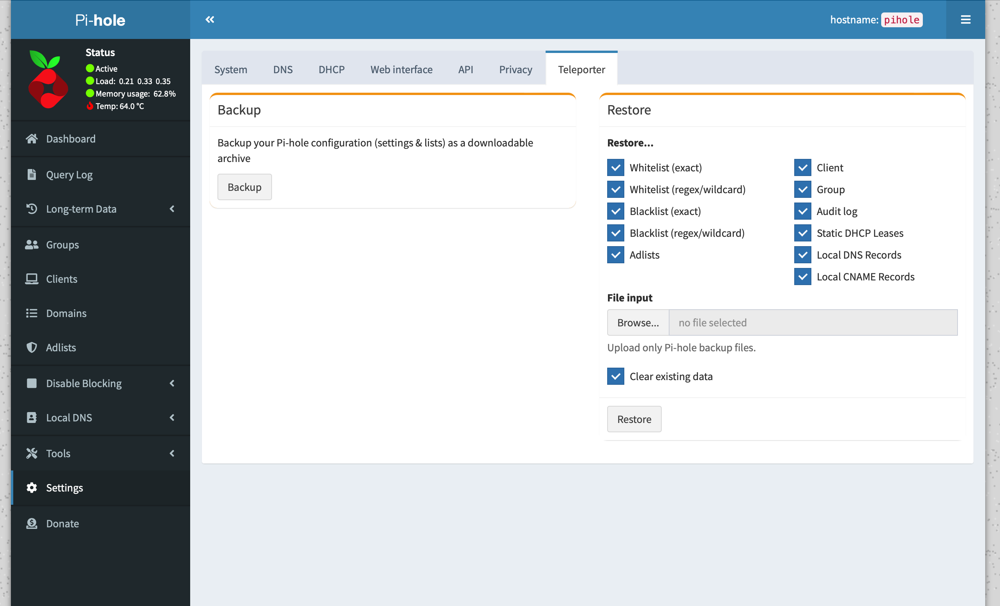
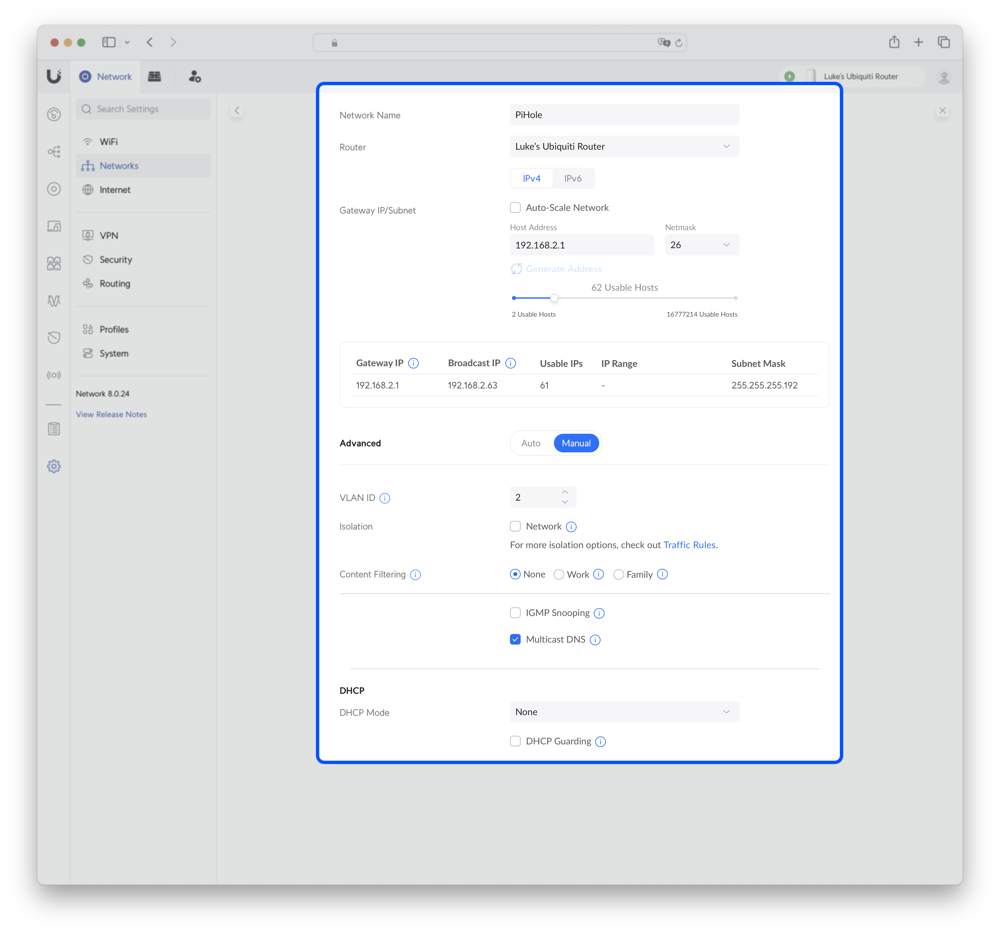
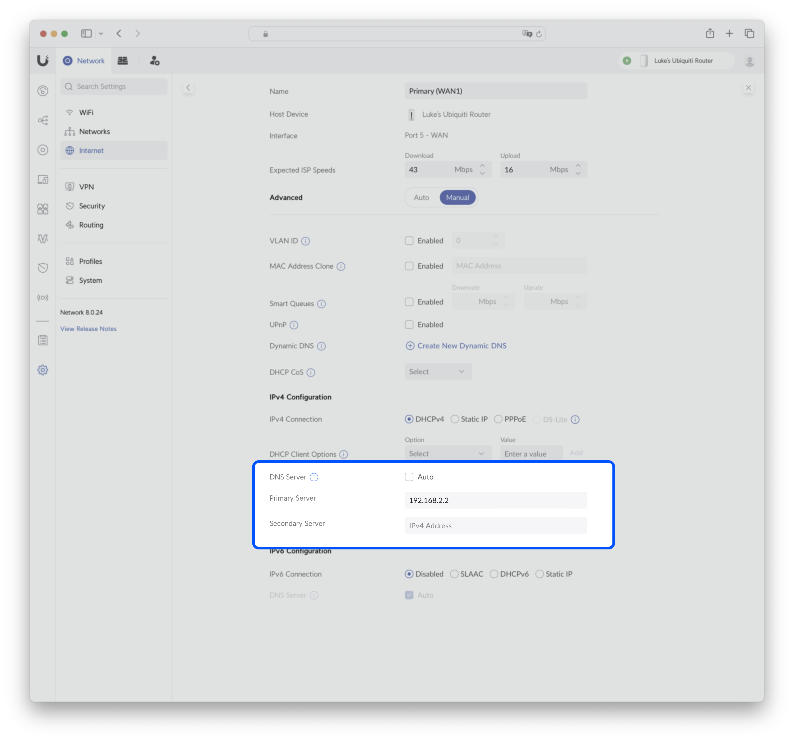
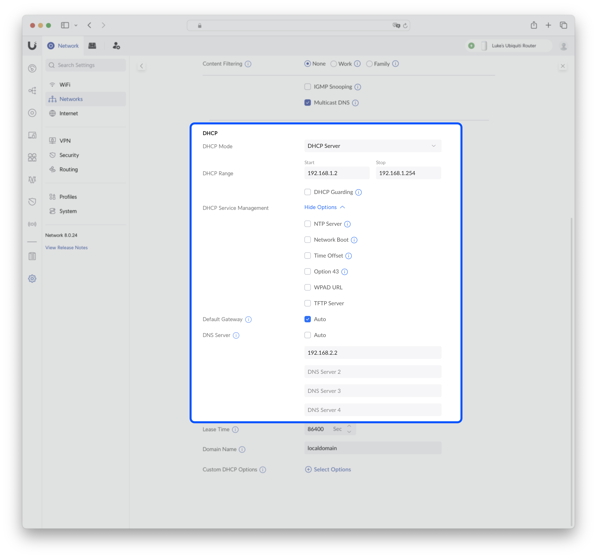
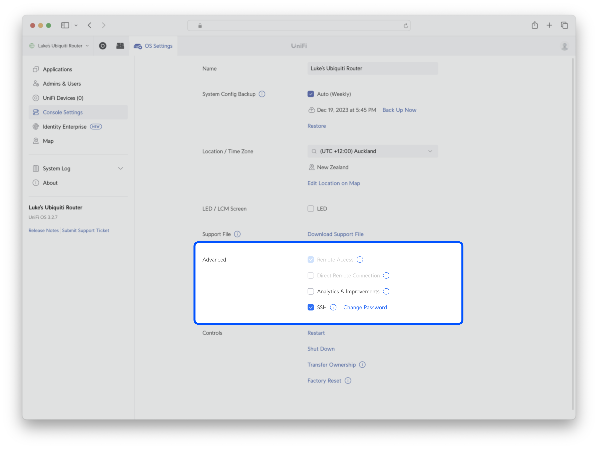
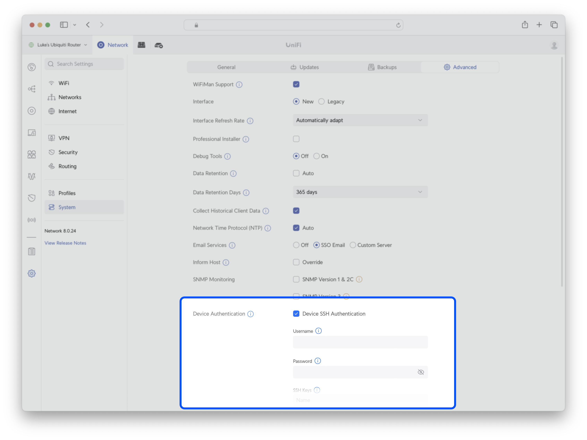

# PiHole on UniFi OS 3

I previously have [written a guide][1] for my own benefit on how to configure PiHole running inside a UniFi Dream Machine (UDM) running UniFi OS 1.x.
This guide amends those instructions for UniFi OS 3.x, which contains many large architectural changes; this requires us to use [`nspawn`][2] instead of `podman`—which we used with UniFi OS 1.x—for containerization of our PiHole installation.

We will be following the stellar [containerization][3] and [pihole configuration][4] guides from the `unifi-utilities` repo, adapted here with some personal preference adjustments to configuration
(but many thanks to the contributors of that guide for the prior art).
This involves using `systemd-nspawn` to create a container—that can be controlled via `machinectl`—that will run our `pihole` instance.

## Steps

### Prerequisites

If you're migrating from a previous PiHole configuration that you're planning to use again, be sure to back up your PiHole configuration using the _Teleporter_ functionality.

1. Navigate to the PiHole web admin interface, _Settings_ → _Teleporter_, and export a backup from this screen.

    

### Part 1. UniFi OS configuration

1.  Create a new VLAN in your UDM [here][5], with the following settings.
    I have chosen to use `192.168.2.x` as the address range for this network—with a corresponding VLAN ID of 2—as it is the next integer beyond `192.168.1.x`, which is the VLAN containing all my client devices.
    We will assign our PiHole instance an IP of `192.168.2.2` within this VLAN, which will be used for configuration later.

    | Setting            | Value          |
    | ------------------ | -------------- |
    | Network Name       | PiHole         |
    | Auto-scale Network | false          |
    | Gateway IP/Subnet  | 192.168.2.1/26 |
    | VLAN ID            | 2              |
    | Network Type       | Standard       |
    | Content Filtering  | None           |
    | Multicast DNS      | true           |
    | DHCP Mode          | None           |

    

2.  Configure your primary WAN such that its primary DNS Server is set to the IP address of your PiHole instance (as mentioned before, `192.168.2.2`).
    PiHole will then forward DNS requests it determines should be allowed to cloudflare.
    Note that specifying a "secondary" DNS server within the Unifi OS configuration here _will not_ act as a "fallback" server as one might assume, but rather DNS lookups will be distributed _amongst_ these servers.
    This defeats the blocking nature of PiHole and thus this field should be left blank.

        

3.  Likewise, configure your primary LAN's "DHCP Mode" to "DHCP Server", and set the DNS server to point to `192.168.2.2`—ensuring the "Auto" checkbox is off.

    

### Part 2. SSH into your UniFi console

1. Under the _OS Settings_ tab in your UniFi console, click _Console Settings_ → _Advanced_ and tick the _SSH_ checkbox.
   This will let us SSH into our UniFi console.

    

    Note there is also an SSH-related configuration under the _Network_ tab in your UniFi console (_Device SSH Authentication_, click _System_ → _Advanced_ to see it).
    This is unrelated to SSHing into your UniFi OS controller, but is shown in the image below for posterity.

    

2. I also added a `Host` configuration into my `.ssh/config` to make SSHing into my console less typing:

    ```ssh
    Host udm
        User root
        HostName 192.168.1.1
    ```

    See the note at the end of this document if this host configuration looks different to your previous configuration for UniFi OS 1.x.

3. SSH into your UniFi console.

### Part 3. Container creation and configuration

1.  Install `systemd-container` and `debootstrap` to create a directory with a base debian system.
    We will then use `systemd-nspawn` to boot the container.

    ```shell
    apt -y install systemd-container debootstrap
    ```

2.  Create a `pihole` directory containing a base debian system in `/data/custom/machines`.

    ```shell
    mkdir -p /data/custom/machines
    cd /data/custom/machines
    debootstrap --include=systemd,dbus unstable pihole
    ```

3.  Once ready, we can create a shell to this container and perform some initial configuration by setting a password, enabling networking, and setting our DNS resolver to cloudflare.

    ```shell
    systemd-nspawn -M pihole -D /data/custom/machines/pihole
    passwd root # Set your password here
    systemctl enable systemd-networkd
    echo "nameserver 1.1.1.1" > /etc/resolv.conf
    echo "pihole" > /etc/hostname
    exit
    ```

4.  Now back on the host OS of the UDM device, symlink the container directory to `/var/lib/machines` so we can control it with `machinectl`.

    ```shell
    mkdir -p /var/lib/machines
    ln -s /data/custom/machines/pihole /var/lib/machines
    ```

5.  Create a `pihole.nspawn` file (using `vim`, etc) to configure parameters of the container (such as bind mounts and networking).
    The file should be named after the container that is being configured, and will be used by `systemd-nspawn`.
    There is some useful documentation on the configuration options of this file at [debian.org][6].
    Here is the configuration we will use going forward, take note of the `MACVLAN` parameter being set to `br2`—this relates to the VLAN network we will isolate our container on.

    ```nspawn
    [Exec]
    Boot=on
    ResolvConf=off

    [Network]
    MACVLAN=br2
    ```

6.  Grab a copy of the `10-setup-network.sh` [script][7] from the `unifios-utilities` repository, place it in `/data/on_boot.d` and edit it with the VLAN and IP configuration for your container and gateway from the above table.
    Amend the arguments like so:

    -   Modify `VLAN` to match the identifier of your PiHole's VLAN (for me, `2`).
    -   Modify `IPV4_IP` to match the IP address of your container (`192.168.2.2`).
    -   Modify `IPV4_GW` to match the CIDR-notated IP address of the gateway interface/network (`192.168.2.1/26`).
    -   Leave `IPV6_GW` and `IPV6_IP` as empty strings.

    Executing this script will create a `brX.mac` interface as a gateway bridge.
    We have already ensured our `pihole.nspawn` file properly references this VLAN bridge in the previous step.

    ```shell
    mkdir -p /data/on_boot.d && cd /data/on_boot.d
    curl -LO https://raw.githubusercontent.com/peacey/unifios-utilities/nspawn/nspawn-container/scripts/10-setup-network.sh
    ```

7.  Create a `mv-br2.network` file within the `etc/systemd/network` directory _inside your container_.
    I have chosen to name of this network (`mv-br2`) to use the same integer as my VLAN for consistency.

    ```shell
    cd /data/custom/machines/pihole/etc/systemd/network
    touch mv-br2.network
    ```

    Write the following configuration to the file:

    ```network
    [Match]
    Name=mv-br2

    [Network]
    IPForward=yes
    Address=192.168.2.2/26
    Gateway=192.168.2.1
    ```

    -   The `Name` should match the name of the network file, and also the identifier of the VLAN you are using.
    -   The `Address` should be the ID address of the container, this time in CIDR-notated format.
    -   The `Gateway` should be the IP address of the gateway, this time _without_ CIDR notation.

8.  Now, we will run the customised `10-setup-network.sh` script, and check everything is functioning as expected.

    ```shell
    chmod +x /data/on_boot.d/10-setup-network.sh
    /data/on_boot.d/10-setup-network.sh
    machinectl reboot pihole
    machinectl shell pihole
    ```

    Run `ip addr show mv-br2` (or the ID of the bridge you've configured) and inspect the output.
    You should see the IP address present here.

    ```ip output
    8: mv-br2@if47: <BROADCAST,MULTICAST,UP,LOWER_UP> mtu 1500 qdisc noqueue state UP group default qlen 1000
    link/ether 1e:10:92:a5:d5:45 brd ff:ff:ff:ff:ff:ff link-netnsid 0
    inet 192.168.2.2/26 brd 192.168.2.63 scope global mv-br2
        valid_lft forever preferred_lft forever
    inet6 fe80::1c10:92ff:fea5:d545/64 scope link
        valid_lft forever preferred_lft forever
    ```

    Run `ping -c4 1.1.1.1` to confirm connections to the outside world are working.

9.  This network configuration script needs to be run on boot—this can be accomplished with the [UDM boot script][8] from `unifios-utilities`, that will execute any script placed into `/data/on_boot.d`.

    ```shell
    curl -fsL "https://raw.githubusercontent.com/unifi-utilities/unifios-utilities/HEAD/on-boot-script/remote_install.sh" | /bin/sh
    ```

### Part 4. Check your container is working and final steps

1. Let's run through some checks:

    - Typing `machinectl status pihole` should show us the details of our running container.
    - We can enter into a shell in this container via `machinectl shell pihole` (typing `exit` from within this shell will place us back in UniFi OS).
    - Typing `machinectl login pihole` will present us a login prompt as expected from a linux system.

2. To start our container on system boot, run `machinectl enable pihole`.

### Part 5. Firmware persistence

1. When the firmware on your UDM is updated, `/data` and `/etc/systemd` will be preserved. These contain our container storage and boot scripts, respectively. But—`/var` and `/usr` will be deleted!
   This is where we symlink our container to (via `machinectl`).
   Furthermore, any additional debian packages that are installed on the host OS (like `systemd-container`) will also be deleted.
   To mitigate this, we can run a script on boot to reinstall our packages and re-symlink our container so `machinectl` can control it, which is again provided by `unifios-utilities`:

    ```shell
    cd /data/on_boot.d
    curl -LO https://raw.githubusercontent.com/peacey/unifios-utilities/nspawn/nspawn-container/scripts/0-setup-system.sh
    chmod +x /data/on_boot.d/0-setup-system.sh
    ```

2. If the internet is not available during a first boot after an update, this script won't be able to fetch the packages over the internet, so we need the `dpkg` files backed up to be used for an install instead:

    ```shell
    mkdir -p /data/custom/dpkg && cd /data/custom/dpkg
    apt download systemd-container libnss-mymachines debootstrap arch-test
    ```

    Because we've installed the unifios-utilities `on-boot-script` previously, this means `0-setup-system.sh` itself will be started on boot.

### Part 6. PiHole configuration

1.  Spawn a shell into your container.

    ```shell
    machinectl shell pihole
    ```

2.  Within our container, we will now install PiHole procedurally, by following the prompts from the PiHole installer.

    ```shell
    apt -y install curl
    curl -sSL https://install.pi-hole.net | PIHOLE_SKIP_OS_CHECK=true bash
    ```

    You must use `PIHOLE_SKIP_OS_CHECK=true` so PiHole can be installed on Debian `unstable`.
    We can now run `apt clean` to delete the package cache and shrink the container's size.

3.  Select "Continue" when the install indicates a static IP is needed.

4.  Select "Cloudflare" as our custom upstream DNS provider.

5.  As we will be using PiHole's teleport functionality to import a previous PiHole configuration, select "No" to including blocklists on install.

6.  Select "Yes" to install the admin web interface.

7.  Select "Yes" to install the default web server that PiHole uses (`lighthttpd`).

8.  Select "Yes" to enabling query logging, and on the next page to determine how verbose query logging should be, select "Show everything".

9.  PiHole's installation will now be complete!
    You should now set a password, or configure PiHole to use your previous password if you're migrating from a previous PiHole installation.
    Run the [PiHole password command][9], and then follow the prompts to set a password:

        ```shell
        # -a flag indicates "admin"
        # -p flag indicates "password"
        pihole -a -p
        ```

10. PiHole's web admin interface should now be accessible at [pi.hole/admin][10]—login using the password you set in the previous step.

11. If you plan on using a fresh install of PiHole, you can skip this step.
    Otherwise, if you plan to use PiHole's teleporter functionality to import a previous configuration, do that now.
    In the PiHole admin interface, navigate to _Settings_ → _Teleporter_, and restore your backed up `.tar.gz` file, choosing to restore whatever configuration options you'd like.

12. Under _Settings_ → _DNS_, if it isn't already ticked, select "Permit all origins".
    This allows requests originating from more than a single hop away (such as your LAN clients).

You should now be complete with a functioning PiHole instance running inside a container of your UDM. Enjoy! Read over the FAQ below if you've had an issue or want to know more about this process.

## FAQ

### What is "Device SSH Authentication" for if not for SSHing into a UniFi OS console?

To my understanding this allows you to SSH into other UniFi devices (access points, etc)—potentially from your UniFi OS console; and is unrelated to SSHing into your controller itself.

### When running `ip addr show mv-br2`, what is `192.168.2.63` doing in the output?

This is the broadcast address of the interface. Because we set our subnet mask to 26, this results in 62 available clients on the network, from `192.168.2.1` to `192.168.2.62`—where the next IP address, `192.168.2.63` becomes the broadcast address.
[This calculator][11] is handy for showing how these addresses can be arrived at.

### Downloading `apt` packages for backup resulted in a warning about performing downloads "unsandboxed". Why is this?

For example:

```
W: Download is performed unsandboxed as root as file '/data/custom/dpkg/arch-test_0.17-1_all.deb' couldn't be accessed by user '_apt'. - pkgAcquire::Run (13: Permission denied)
```

The `apt` package manager will usually try to fetch packages using the `_apt` user as a security measure;
however, if `apt` is requested to install a package that already exists on the filesystem, and the `_apt` user does not have permission to read that file, then instead the `root` user will be used to do so.
This leads to the warning message.

### When configuring PiHole for the first time, why did this error appear in the setup process?

```
[✗] Unable to fill table adlist in database /etc/pihole/gravity.db
Error: cannot open "/tmp/tmp.awdNvLc8bI"
```

I'm not sure. This may be a permissions issue, or something else has caused this temporary file to not exist at the time it needed to be accessed.

### The PiHole docker container, FTL, and WebUI version numbers in the footer of the PiHole Admin GUI read "N/A", how do I fix this?

After rebooting the PiHole instance, the versioning changed from "N/A" to "vDev".
Running `pihole updatechecker` resulted in the correct version numbering being displayed.

### Why is the number of blocked domains incorrect in the PiHole Web UI?

Updating gravity after restoring your PiHole configuration should fix this.
This can be accomplished via `pihole updategravity`.
The number of blocked domains displayed as being blocked in the web admin UI should now be correct.

### PiHole won't let me restore from my backup!

When I attempted to restore my previous PiHole configuration from backup, I believe Safari automatically unarchived the `.tar.gz` file to a `.tar` file.
I resolved this by unarchiving the `.tar` file to a directory, and then archiving it back to a `.tar.gz` file via the command `tar czf [out] [in]`.

### How do I back-up long term query statistics of my PiHole?

This should be possible via backing up both the query and domain databases (`/etc/pihole/pihole-FTL.db` and `/etc/pihole/gravity.db`) respectively.
More information on the contents and schema of PiHole's SQLite databases can be found [in the documentation][12].

## Notes

-   Specifying `ssh-rsa` is no longer needed to SSH into the device.
    This was resolved in Unifi OS 2.4.x.

[1]: https://gist.github.com/lukeify/96e73218b4de79891a46a89fdc2c2045
[2]: https://wiki.debian.org/nspawn
[3]: https://github.com/unifi-utilities/unifios-utilities/tree/main/nspawn-container
[4]: https://github.com/unifi-utilities/unifios-utilities/blob/main/nspawn-container/examples/pihole/README.md
[5]: https://192.168.1.1/network/default/settings/networks/new
[6]: https://manpages.debian.org/unstable/systemd-container/systemd.nspawn.5.en.html
[7]: https://github.com/unifi-utilities/unifios-utilities/blob/main/nspawn-container/scripts/10-setup-network.sh
[8]: https://github.com/unifi-utilities/unifios-utilities/tree/main/on-boot-script
[9]: https://docs.pi-hole.net/core/pihole-command/#password
[10]: http://pi.hole/admin
[11]: https://jodies.de/ipcalc
[12]: https://docs.pi-hole.net/database/
