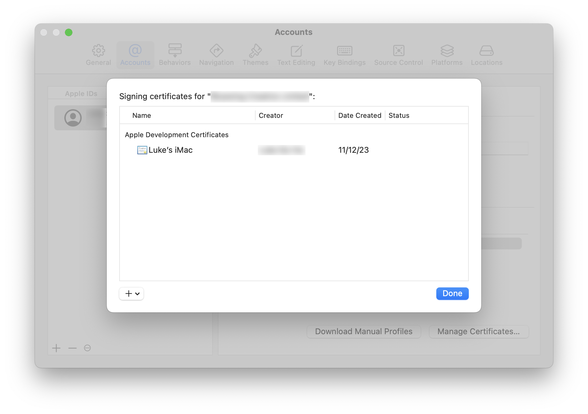
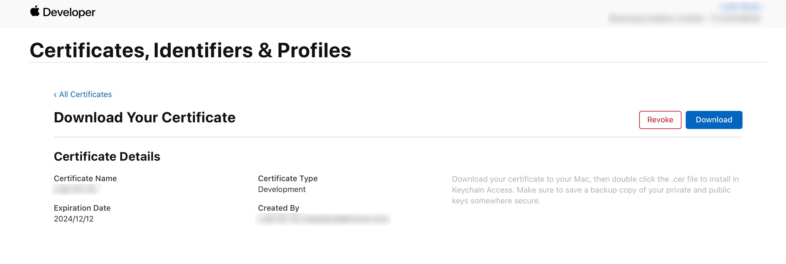

# Sideloading iOS Apps

With a paid Apple Developer account, you can sideload apps onto an iOS device for up to 1 year by signing them locally.
This means you don't need to use services like [AltStore][1] or [SideStore][2] to sideload applications.

## Configuration

1. Open _Xcode_, navigate to _Settings_ → _Account_, and double click your paid developer team to display a modal containing your signing certificates.
   Ensure a signing certificate exists for your user.
   If one does not exist, you can create one in the bottom-left corner by clicking the _+_ dropdown and then _Apple Development_.

    

    - Note there will be an additional "Personal Team" listed under the _Account_ section, which seems to be an implementation detail of how Apple provided free developer access to casual iOS users.
      Don't use this team, as managing aspects of this "Personal Team" from developer.apple.com [does not appear to be possible][8].
      From [Apple's documentation][3]:

        > A: Xcode 7 and Xcode 8 allow you to select the free personal team provided with your Apple ID for signing your app. This team allows you to build apps for your personal use on devices owned by you, but it does not allow you to code sign apps destined for the App Store or for enterprise use.
        >
        > You can identify this account by looking in the accounts tab of the Xcode preferences. It is also displayed in the team menu displayed in a target's general build settings. Your personal account will be the account with the string '(Personal Team)' beside the name.

    - Once created, visit _Keychain Access_ and you will see two new entries:
        1. A private key titled `Apple Development: <Name> (<Team Name>)`
        2. A certificate title `Apple Development: <Name> (<Team ID>)`
    - You can also visit [_Certificates, Identifiers & Profiles_][5] to see and download the certificate there.

        

2. Create a Wildcard App Identifier in the [_Identifiers_ section][6] of developer.apple.com.
   The _Description_ will end up being the displayed name of the identifier.
   Set the _Bundle ID_ to _Wildcard_ with an asterisk.
   No capabilities or app services seem to be needed.

3. Ensure the device you'd like to load the application on is present in the [_Devices_ section][7] of developer.apple.com.
   You can have up to 100 iPhones listed within a one-year period (you have a once-a-year opportunity to unregister previous devices that becomes available on the anniversary of your developer membership).
   Set the _Platform_ to _iOS, iPadOS, tvOS, watchOS, visionOS_, the _Device Name_ to anything (although preferably it's the same device name as within the device).

    - The _Device ID_ or _UDID_ (Unique Device Identifier) can be found in both _Finder_ and _Apple Configurator_ when the device is connected.
      For _Finder_, when the device is connected, navigate to the iPhone's pane, and click the device details under the name (for example _iPhone 15 Pro — 511.87GB (xxx.xxGB available)_) once.
      The _UDID_ will be shown alongside the _Serial Number_ and _Device Model_.

        

4. Finally, relate all of these entities together using a _Profile_, which is, as Apple describes it:

    > Provisioning profiles allow you to install apps onto your devices. A provisioning profile includes signing certificates, device identifiers, and an App ID.

    Click _Generate Profile_, and follow the provisioning profile registration flow:

    1. Select _iOS App Development_ to create a provisioning profile to install on an iOS device.
    2. Select the wildcard identifier App ID that you generated earlier.
       This identifier should contain the team ID followed by a period and an asterisk (i.e. `ABCDEFGH.*`).
    3. Select the signing certificate that was created/verified to exist in Xcode in step 1.
    4. Select the device you registered in step 3.
    5. Provide a name for the provisioning profile, and click _Generate_.
       You don't need to download a copy of the profile because automatic signing from _Xcode_ will ensure the profile is used when the application is signed.

5. Download the `ipa` file of the application you'd wish to sideload. In my case, [_uYouEnhanced_][10].
6. Install [_iOS App Signer_][9] via brew (`brew install ios-app-signer`), and skip to step 7 of their instructions.
    1. Select the downloaded `ipa` file from step 5 as the input file in _iOS App Signer_.
    2. For _Signing Certificate_, select your paid team's Apple Development signing certificate.
    3. For _Provisioning Profile_, I'm not sure what you need to select.
       What is the distinction between _Re-Sign Only_ and providing a custom provisioning profile? Can _XCode_'s fetching of your profile automatically fill this out?
    4. Ignore the _New Application ID_, _App Display Name_, _App Version_, and _App Short Version_ fields, they can be left blank (the application name for _uYouEnhanced_ will appear as _YouTube_ anyway).
    5. Click _Start_. A signed `ipa` file will be outputted to the location you selected.
7. The _iOS App Signer_ documentation states to install the signed application using _Xcode_'s _Devices and Simulators_ functionality.
   At least with my combination of _Xcode_ 15, macOS 13, and iOS 17, this process would fail with the message "The item at YouTube.ipa is not a valid bundle".

    What did work was installing via _Apple Configurator_ instead—connect the device and upload the `ipa` from your Mac.

If once the app is installed, you attempt to open the app and see a modal with the message "The app cannot be installed because its integrity could not be verified!", you have messed up your provisioning profile (or the entities it refers to).
Double-check your certificates, identifiers, and devices and try again.

## Deleting Certificates

You will notice when right-clicking on an existing certificate that _Delete Certificate_ is disabled (or at least I have never seen it available as an option).
The implications and steps to deleting a certificate depends on which "team" you plan to delete a certificate for:

**For "Personal Teams"**, it is not recommended to "delete" certificates, and it may not be possible to properly delete them at all.
If you must, you can open _Keychain Access_, and clear out the _App Development_ certificate and private key records that match your personal team.
Doing this though will result in the certificate _not being deleted_ from the certificates modal, but rather being greyed out with a status of _Not in Keychain_.

**For an Organization**, head to [developer.apple.com][4], click through to [_Certificates, Identifiers & Profiles_][5], select the certificate, and click _Revoke_ in the top-right corner.

## Questions

- Can _Xcode_ automatically retrieve the created provisioning profile from developer.apple.com so we don't have to download it?
- What is the definition of "automatic signing"?

## Interesting info

[StackOverflow: Xcode -How to add a private key to Development Certificate if it's created using the Revoke button][11]

[1]: https://github.com/altstoreio/AltStore
[2]: https://sidestore.io
[3]: https://developer.apple.com/library/archive/qa/qa1915/_index.html
[4]: https://developer.apple.com
[5]: https://developer.apple.com/account/resources/certificates/list
[6]: https://developer.apple.com/account/resources/identifiers/list
[7]: https://developer.apple.com/account/resources/devices/list
[8]: https://itecnote.com/tecnote/xcode-how-to-manage-personal-team-info-on-apple-developer-website/
[9]: https://dantheman827.github.io/ios-app-signer
[10]: https://github.com/arichorn/uYouEnhanced
[11]: https://stackoverflow.com/a/58847332
