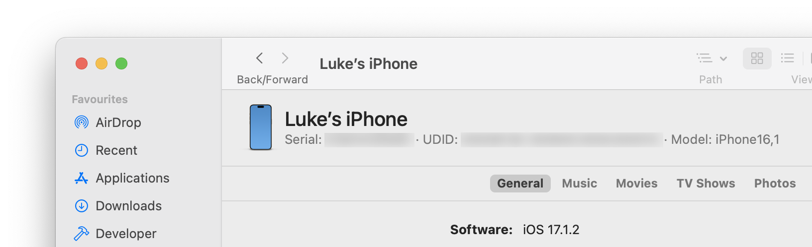

# Sideloading iOS Apps

With a paid Apple Developer account, you can sideload apps onto an iOS device for up to 1 year by signing them locally. This means you don't need to use services like AltStore or [SideStore][2] to sideload applications.

## Configuration

1. Open `Xcode.app`, navigate to `Settings` → `Account`, and double click either the team or your personal user to display a modal containing your signing certificates. Ensure a signing certificate exists for your user. If one does not exist, you can create one in the bottom-left corner by clicking the "Plus" dropdown and then "Apple Development".

   * Note there will be a "Personal Team" listed under the `Account` section, which seems to be an implementation detail of how Apple provided free developer access to casual iOS users. Don't use this one as managing aspects of this "Personal Team" from developer.apple.com [does not appear to be possible][8]. From [Apple's documentation][3]:

        > A: Xcode 7 and Xcode 8 allow you to select the free personal team provided with your Apple ID for signing your app. This team allows you to build apps for your personal use on devices owned by you, but it does not allow you to code sign apps destined for the App Store or for enterprise use.
        > 
        > You can identify this account by looking in the accounts tab of the Xcode preferences. It is also displayed in the team menu displayed in a target's general build settings. Your personal account will be the account with the string '(Personal Team)' beside the name.

     

    * Once created, visit `Keychain Access.app` and you will see two new entries:
        1. A private key titled `Apple Development: <Name> (<Team Name>)`
        2. A certificate title `Apple Development: <Name> (<Team ID>)`
   
    * You can also visit "[Certificates, Identifiers & Profiles][5]" and see and download the certificate there.
   
     
   
2. Create a Wildcard App Identifier in the [Identifiers section][6] of developer.apple.com. The "Description" will end up being the identifier of the identifier, set the "Bundle ID" to "Wildcard" with an asterisk. No capabilities or app servces seem to be needed.

3. Ensure the device you'd like to load the application on is present in the [Devices section][7] of developer.apple.com. You can have up to 100 iPhones present within a one-year period (you have a once-a-year opportunity to unregister previous devices that occurs on the anniversary of your developer membership). Set the "Platform" to "iOS, iPadOS, tvOS, watchOS, visionOS", the "Device Name" to anything (although preferably it's the same device name within the device).

    * The "Device ID" or UDID (Unique Device Identifier) can be found in both Finder and Apple Configurator when the device is connected. For Finder, when the device is connected, navigate to the iPhone's pane, and click the device details under the name (for example "iPhone 15 Pro — 511.87GB (xxx.xxGB available)") once. The UDID will be shown alongside the Serial Number and Device Model.
    
    
   

4. Finally, relate all of these entities together using a "Profile", which is, as Apple describes it: 

    > Provisioning profiles allow you to install apps onto your devices. A provisioning profile includes signing certificates, device identifiers, and an App ID.

    Click "Generate Profile", and follow the provisioning profile registration flow:

    1. Select "iOS App Development" to create a provisioning profile to install on an iOS device.
   2. Select the wildcard identifier App ID that you generated earlier. This identifier should contain the team ID followed by a period and an asterisk (i.e. `ABCDEFGH.*`).
   3. Select the signing certificate that was created/verified to exist in Xcode in step 1.
   4. Select the device you registered in step 3.
   5. Provide a name for the provisioning profile, and click "Generate". You don't need to download a copy of the profile because automatic signing from Xcode will ensure the profile is used when the application is signed.

5. Download the `ipa` file of the application you'd wish to sideload. In my case, [uYouEnhanced][10].
6. Install [iOS App Signer][9] via brew (`brew install ios-app-signer`), and skip to step 7 of the instructions.
   1. Select the downloaded `ipa` file from step 5 as the input file in iOS App Signer.
   2. For "Signing Certificate", select your paid team's Apple Development signing certificate.
   3. For "Provisioning Profile", I'm not sure what you need to select. What is the distinction between "Re-Sign Only" and providing a custom provisioning profile? Can XCode's fetching of your profile automatically fill this out. 
   4. Ignore the "New Application ID", "App Display Name", "App Version", and "App Short Version" fields, they can be left blank (the application name for uYouEnhanced will appear as "YouTube" anyway).
   5. Click "Start". A signed `ipa` file will be outputted.
7. The iOS App Signer documentation states to install the signed application using Xcode's "Devices and Simulators" functionality. At least with my combination of Xcode 15, macOS 13, and iOS 17, this process would fail with "The item at YouTube.ipa is not a valid bundle".

   What did work was installing via Apple Configurator instead—connect the device and upload the `ipa` from your Mac.

If once the app is installed, you attempt to open the app and see a modal with the message "The app cannot be installed because its integrity could not be verified!", you have messed up your provisioning profile (or the entities it refers to). Double-check your certificates, identifiers, and devices and try again.

## Deleting Certificates

You will notice when right-clicking on an existing certificate that "Delete Certificate" is disabled (or at least I have never seen it available as an option). Deleting a certificate properly depends on which "team" you plan to delete a certificate for:

**For "Personal Teams"**, it is not recommended to "delete" certificates, and it may not be possible to properly delete them at all. If you must, you can open `Keychain Access.app`, and clear out the "App Development" certificate and private key records that match your personal team. Doing this though will result in the certificate _not being deleted_ from the certificates modal, but rather being greyed out with a status of "Not in Keychain".

**For an Organization**, head to [developer.apple.com][4], click through to "[Certificates, Identifiers & Profiles][5]", select the certificate, and click "Revoke" in the top-right corner.

## Questions

* Can Xcode automatically retrieve the created provisioning profile from developer.apple.com so we don't have to download it?
* What is the definition of "automatic signing"?

## Interesting info

[StackOverflow: Xcode -How to add a private key to Development Certificate if it's created using the Revoke button][11]

[1]: https://github.com/altstoreio/AltStore
[2]: https://sidestore.io
[3]: https://developer.apple.com/library/archive/qa/qa1915/_index.html
[4]: https://developer.apple.com
[5]: https://developer.apple.com/account/resources/certificates/list
[6]: https://developer.apple.com/account/resources/identifiers/list
[7]: https://developer.apple.com/account/resources/devices/list
[8]: https://itecnote.com/tecnote/xcode-how-to-manage-personal-team-info-on-apple-developer-website/
[9]: https://dantheman827.github.io/ios-app-signer
[10]: https://github.com/arichorn/uYouEnhanced
[11]: https://stackoverflow.com/a/58847332